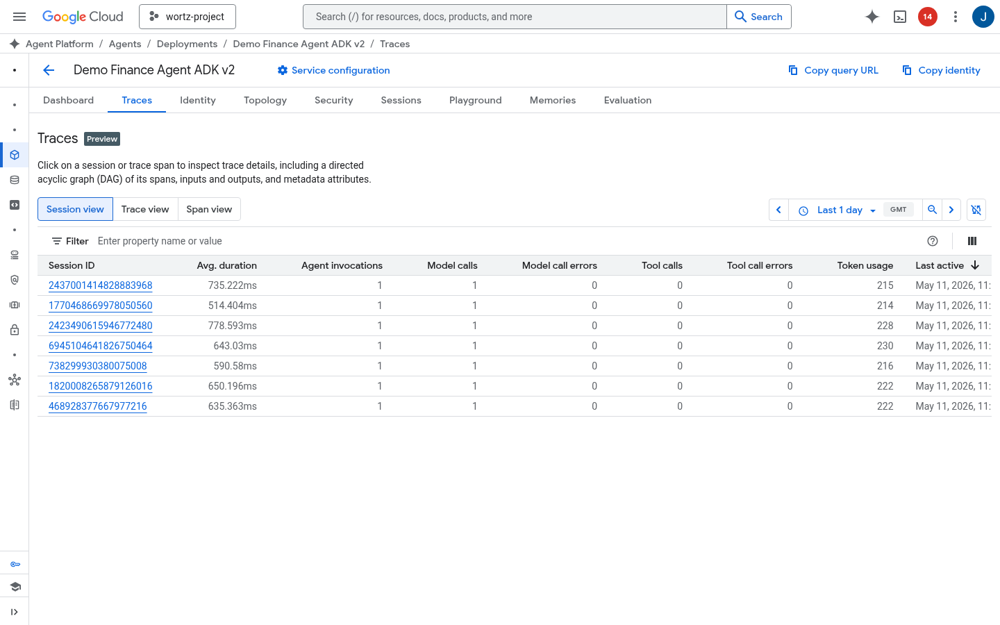
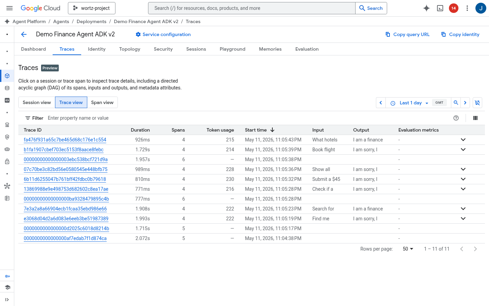

# GEAP Workshop: Enterprise Agent Platform Tour

A hands-on workshop demonstrating the full Gemini Enterprise Agent Platform (GEAP) — from building ADK agents with MCP tools through deployment, governance, evaluation, and optimization.

## Reference Architecture


*Detailed reference architecture showing all GEAP platform components: Shared Service Project (Agent Gateway with ingress/egress, Model Armor input/output screening, Cloud Armor), Build & CI/CD (Cloud Build, Artifact Registry, Workload Identity Federation), three project zones (Development with ADK, Evaluation Framework, GEPA Optimization, Observability; Testing/Staging with staged agents and MCP servers; Production with Agent Engine, SPIFFE Identity, Memory Bank, Multi-Model Router, OTel Tracing), Agent Registry fleet catalog spanning all projects, Vertex AI Models (Gemini Flash/Pro, Claude Opus via LiteLLM), and Gemini Enterprise with A2A protocol for business end users.*

## What's Inside

| Area | Description |
|------|-------------|
| **ADK Agents** | Three agents (travel, expense, coordinator) built with Google Agent Development Kit |
| **MCP Servers** | Three FastMCP tool servers deployed to Cloud Run (search, booking, expense) |
| **Deployment** | Agent Runtime deployment with identity, gateway, and OTel tracing |
| **Evaluation** | One-time, continuous (online evaluators with custom rubrics), and simulated evaluation pipelines |
| **Model Armor** | Model Armor templates for input/output screening + client-side guardrails |
| **Governance** | Agent identity (SPIFFE), agent gateway (ingress + egress), agent registry, Semantic Governance Policies (SGP) |
| **Multi-Model Router** | Complexity-based routing across Flash Lite, Flash, and Opus |
| **Optimization** | Agent optimization via GEPA algorithm |
| **CI/CD** | GitHub Actions workflow running simulated evals on PRs |
| **Diagrams** | Architecture diagrams generated with Paper Banana |

## Documentation

| Document | Description |
|----------|-------------|
| [Workshop Guide](docs/workshop_guide.md) | Full 4-session hands-on walkthrough |
| [Component FAQ](docs/faq.md) | What each component does and why it matters |
| [Evaluation Guide](docs/eval_operations.md) | Evaluation pipeline operations |
| [Cost Comparison](docs/multi_model_cost_comparison.md) | Multi-model routing cost analysis |
| [Slides](docs/slides.pptx) | Workshop deck (34 slides) |

## Quick Start

```bash
# Install dependencies
uv sync

# Copy and configure environment
cp .env.example .env
# Edit .env with your GCP project details

# Run tests
uv run pytest tests/

# Deploy everything in one command
bash scripts/deploy_all.sh

# Setup governance policies (IAM only)
bash scripts/setup_governance_policies.sh

# Setup governance policies with SGP (IAM + Semantic Governance Policies)
bash scripts/setup_governance_policies.sh --sgp
```

## Screenshots

All screenshots are captured from real deployed GCP resources:

| Screenshot | Feature |
|-----------|---------|
|  | Agent Gateway ingress detail (geap-workshop-gateway) |
|  | MCP server on Cloud Run |
|  | Multi-agent deployment |
|  | Agent Gateway (ingress + egress) |
|  | Agent traces — session view with model calls and token usage |
|  | Trace spans — individual trace view |
|  | Input/output screening |
|  | Three-tier eval pipeline |
|  | MCP servers in Agent Registry |
|  | Log Router sinks to BigQuery |
|  | IAM Allow governance policies |
|  | Semantic Governance Policies (SGP) |

## Workshop Guide

See [docs/workshop_guide.md](docs/workshop_guide.md) for the full workshop organized into 4 sessions. For component-level details, see the [Component FAQ](docs/faq.md).

| Session | Topic | Duration |
|---------|-------|----------|
| **Session 1** | AI Gateway / MCP Gateway | ~90 min |
| **Session 2** | AI Gateway / MCP Gateway (continued) | ~75 min |
| **Session 3** | Agent Registry | ~15 min |
| **Session 4** | Model Security / Model Armor | ~15 min |

## Architecture


*Agent Platform architecture showing the full request flow: User → Frontend → Agent Gateway → Agent Identity (Agent Platform Runtime) → Agent Gateway → downstream Agents, Tools, Models, and APIs. Governed by Agent Registry, AI Security, and Access Authorization with full AI Observability.*

### Agent Identity Model


The platform supports three identity types for secure agent operations:

| Identity | Purpose | Issuing System |
|----------|---------|----------------|
| **ID-1: User Identity** | User accessing the agent or SaaS application | Human IdP (Entra, Cloud Identity, Auth0) |
| **ID-2: Agent Identity** | Agent accessing resources under its own authority | GCP — created when agent is deployed |
| **ID-3: Delegated Identity** | Agent accessing resources on behalf of the user | OAuth server (1P or 3P) via OAuth dance |

In our workshop, agents use SPIFFE-based workload identity (ID-2) with attestation policies, and the Agent Gateway enforces identity at the network boundary.

### Paper Banana Architecture Diagrams

| Diagram | Description |
|---------|-------------|
|  | Coordinator agent routing to travel and expense sub-agents with MCP tool servers |
|  | Cloud Run MCP servers + Agent Runtime deployment topology |
|  | Three-tier evaluation: one-time, continuous, and CI/CD simulated |
|  | SPIFFE identity, attestation policies, and Agent Gateway flow |
|  | OTel traces → Cloud Trace → BigQuery pipeline |
|  | GitHub Actions simulated eval gate on pull requests |
|  | Model Armor input/output screening with guardrail callbacks |
|  | Comprehensive reference architecture — all GEAP components in a single diagram |

## Project Structure

```
src/
├── agents/          # ADK agent definitions
├── armor/           # Model Armor config + guardrail callbacks
├── mcp_servers/     # FastMCP tool servers (search, booking, expense)
├── deploy/          # Deployment scripts for Cloud Run + Agent Runtime
├── eval/            # Evaluation pipeline (one-time, online, simulated)
├── optimize/        # Agent optimization (GEPA algorithm)
├── router/          # Multi-model complexity router
└── traffic/         # Traffic generation for OTel traces
scripts/             # Shell scripts for identity, gateway, registry setup
diagrams/            # Paper Banana architectural diagrams
docs/                # Workshop guide
tests/               # Unit and integration tests
```
