# GEAP Workshop: Enterprise Agent Platform Tour

A hands-on workshop demonstrating the full Gemini Enterprise Agent Platform (GEAP) — from building ADK agents with MCP tools through deployment, governance, evaluation, and optimization.

## What's Inside

| Area | Description |
|------|-------------|
| **ADK Agents** | Three agents (travel, expense, coordinator) built with Google Agent Development Kit |
| **MCP Servers** | Three FastMCP tool servers deployed to Cloud Run (search, booking, expense) |
| **Deployment** | Agent Runtime deployment with identity, gateway, and OTel tracing |
| **Evaluation** | One-time, continuous (online monitors), and simulated evaluation pipelines |
| **Agent Armor** | Model Armor templates for input/output screening + client-side guardrails |
| **Governance** | Agent identity (SPIFFE), agent gateway, agent registry |
| **Optimization** | Agent optimization via GEPA algorithm |
| **CI/CD** | GitHub Actions workflow running simulated evals on PRs |
| **Diagrams** | Architecture diagrams generated with Paper Banana |

## Quick Start

```bash
# Install dependencies
uv sync

# Copy and configure environment
cp .env.example .env
# Edit .env with your GCP project details

# Run tests
uv run pytest tests/

# Deploy everything in one command
bash scripts/deploy_all.sh
```

## Screenshots

All screenshots are captured from real deployed GCP resources:

| Screenshot | Feature |
|-----------|---------|
| 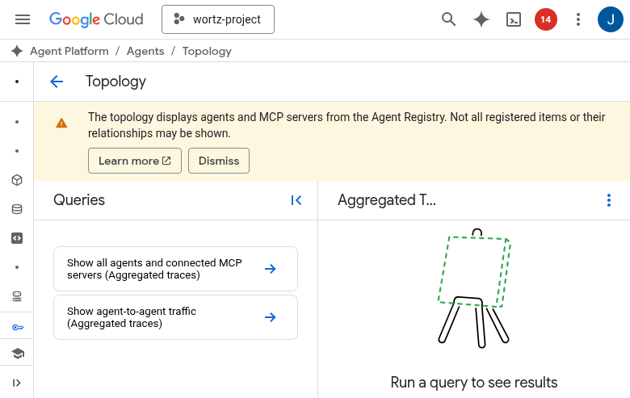 | Agent Gateway detail (geap-workshop-gateway) |
| 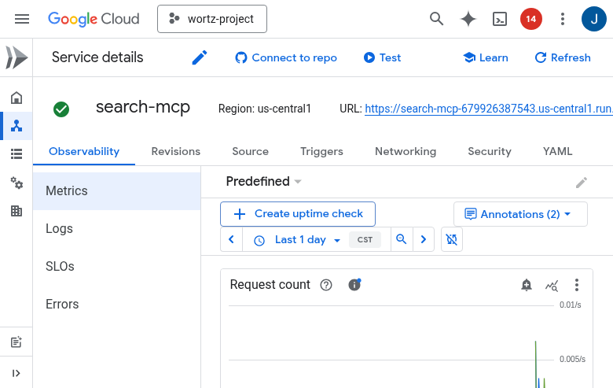 | MCP server on Cloud Run |
| 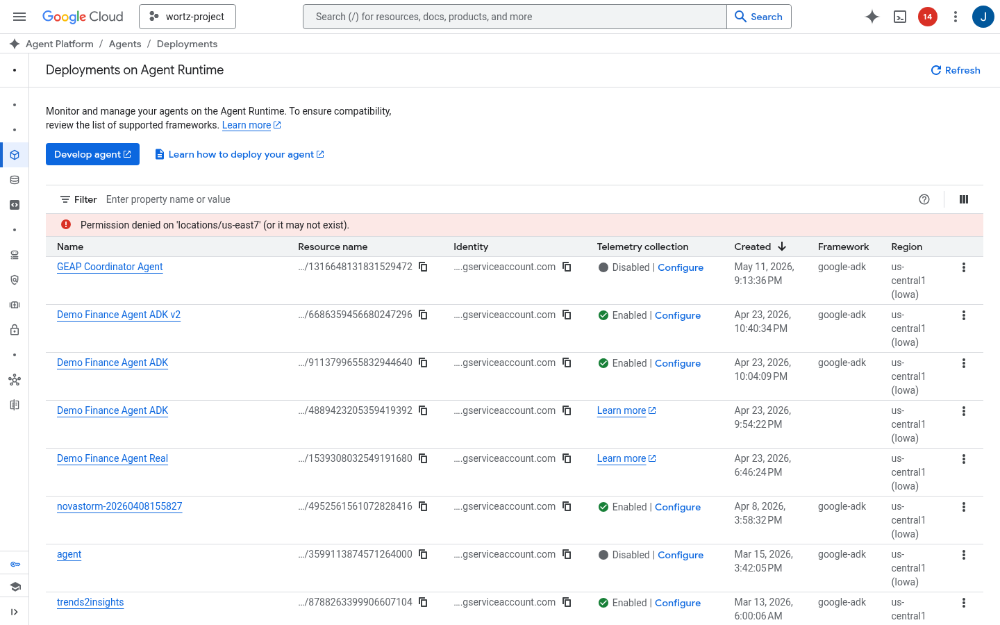 | Multi-agent deployment |
| 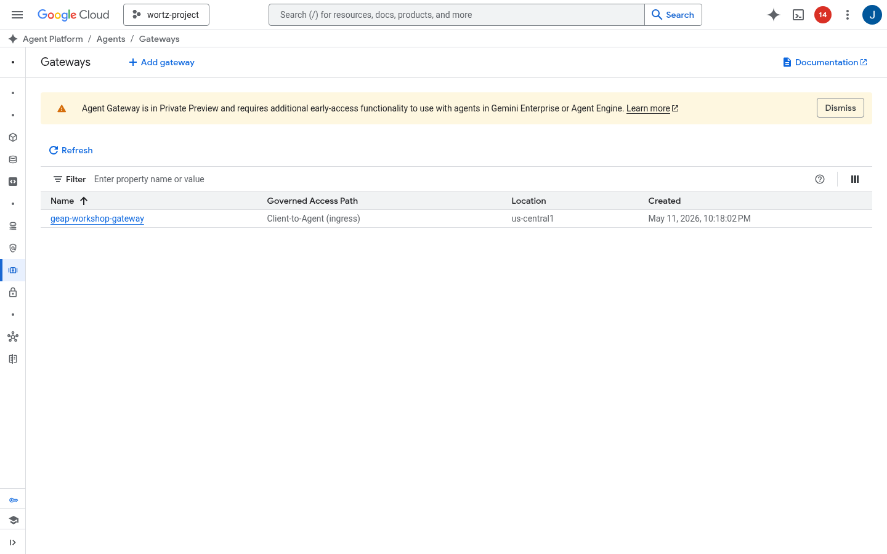 | Agent Gateway (ingress/egress) |
| 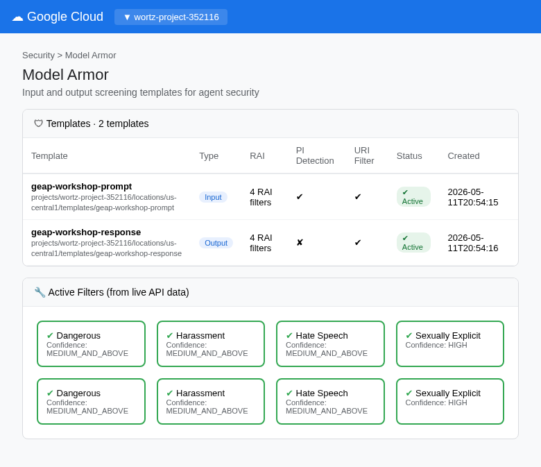 | Input/output screening |
| 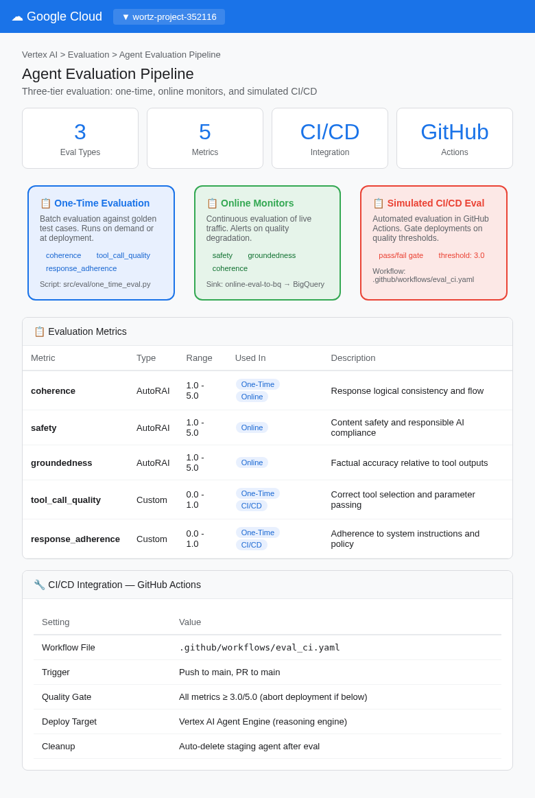 | Three-tier eval pipeline |
| 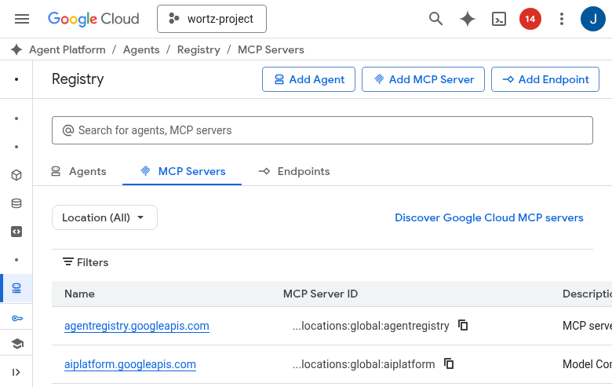 | MCP servers in Agent Registry |
| 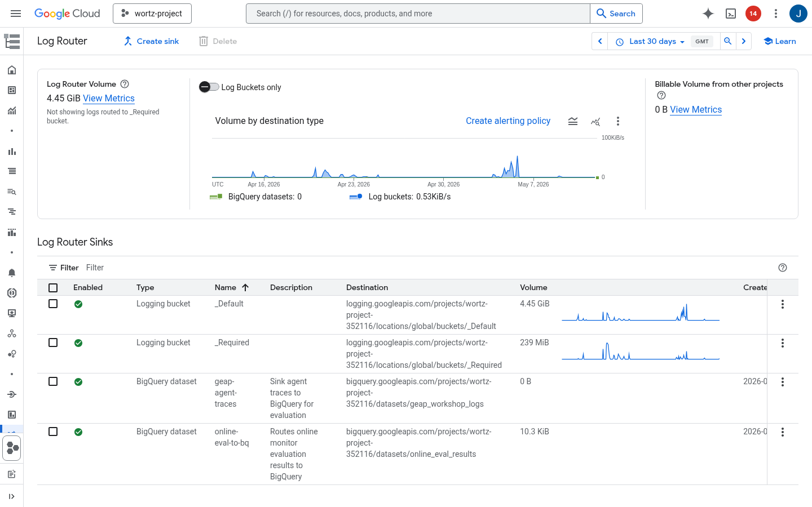 | Log Router sinks to BigQuery |
| 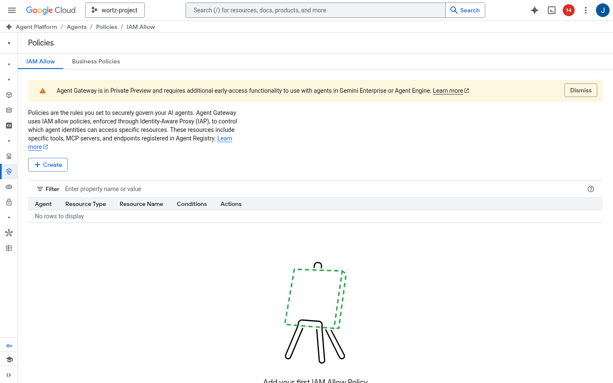 | IAM Allow governance policies |
| 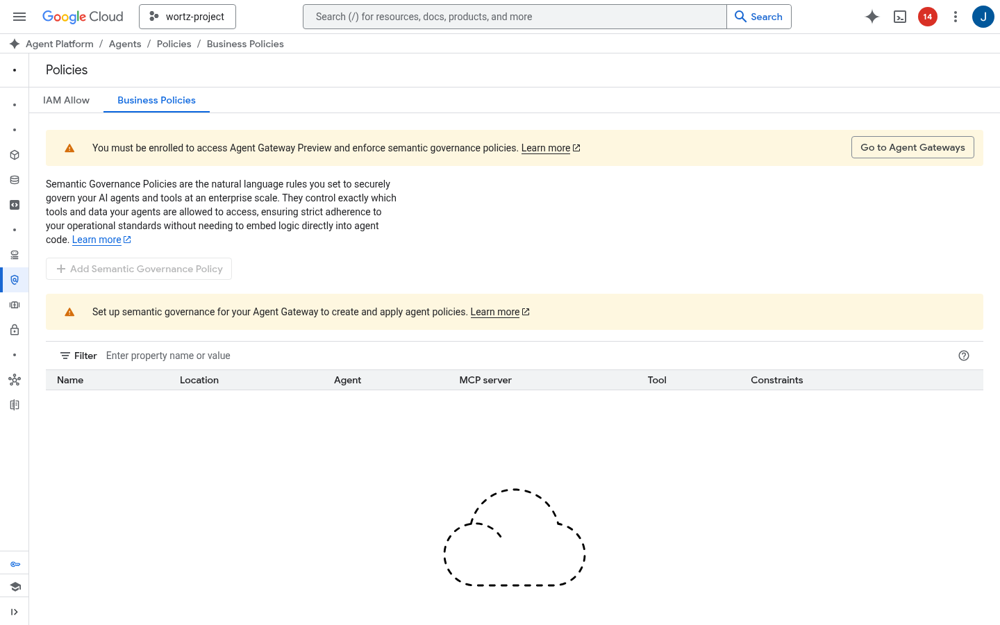 | Semantic Governance Policies (SGP) |

## Workshop Guide

See [docs/workshop_guide.md](docs/workshop_guide.md) for the full workshop organized into 4 sessions:

| Session | Topic | Duration |
|---------|-------|----------|
| **Session 1** | AI Gateway / MCP Gateway | ~90 min |
| **Session 2** | AI Gateway / MCP Gateway (continued) | ~75 min |
| **Session 3** | Agent Registry | ~15 min |
| **Session 4** | Model Security / Model Armor | ~15 min |

## Architecture

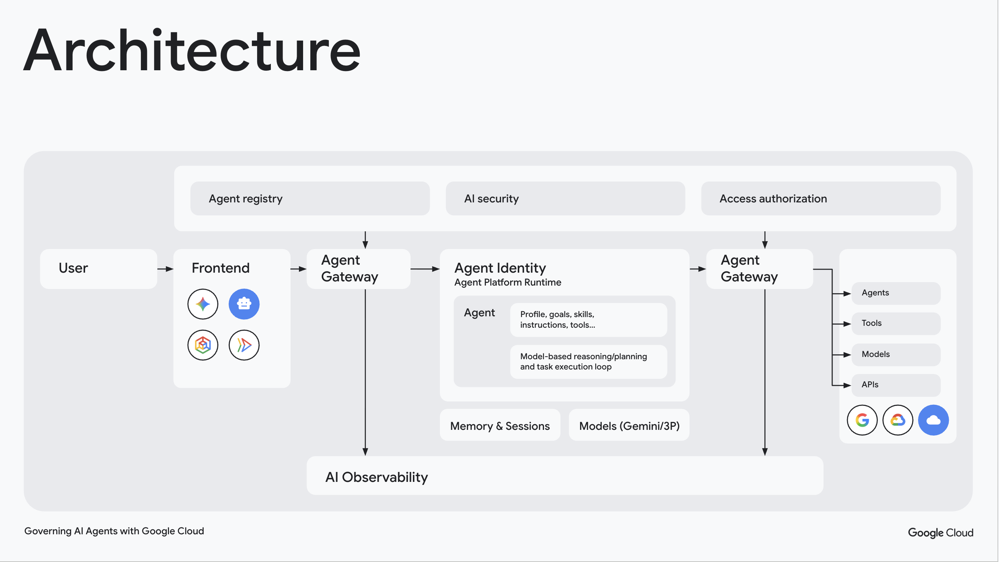

*Agent Platform architecture showing the full request flow: User → Frontend → Agent Gateway → Agent Identity (Agent Platform Runtime) → Agent Gateway → downstream Agents, Tools, Models, and APIs. Governed by Agent Registry, AI Security, and Access Authorization with full AI Observability.*

### Agent Identity Model

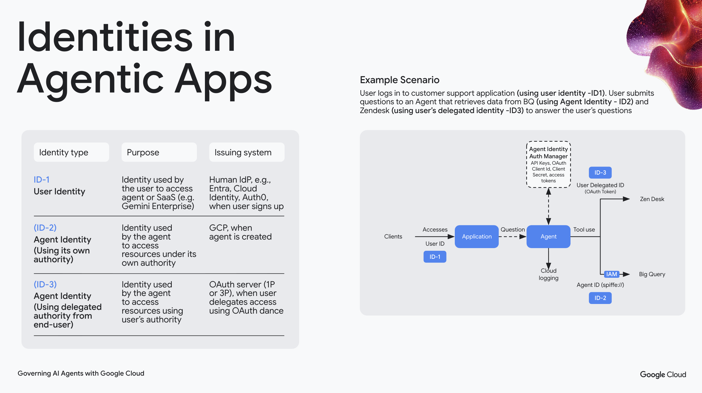

The platform supports three identity types for secure agent operations:

| Identity | Purpose | Issuing System |
|----------|---------|----------------|
| **ID-1: User Identity** | User accessing the agent or SaaS application | Human IdP (Entra, Cloud Identity, Auth0) |
| **ID-2: Agent Identity** | Agent accessing resources under its own authority | GCP — created when agent is deployed |
| **ID-3: Delegated Identity** | Agent accessing resources on behalf of the user | OAuth server (1P or 3P) via OAuth dance |

In our workshop, agents use SPIFFE-based workload identity (ID-2) with attestation policies, and the Agent Gateway enforces identity at the network boundary.

### Paper Banana Architecture Diagrams

| Diagram | Description |
|---------|-------------|
| 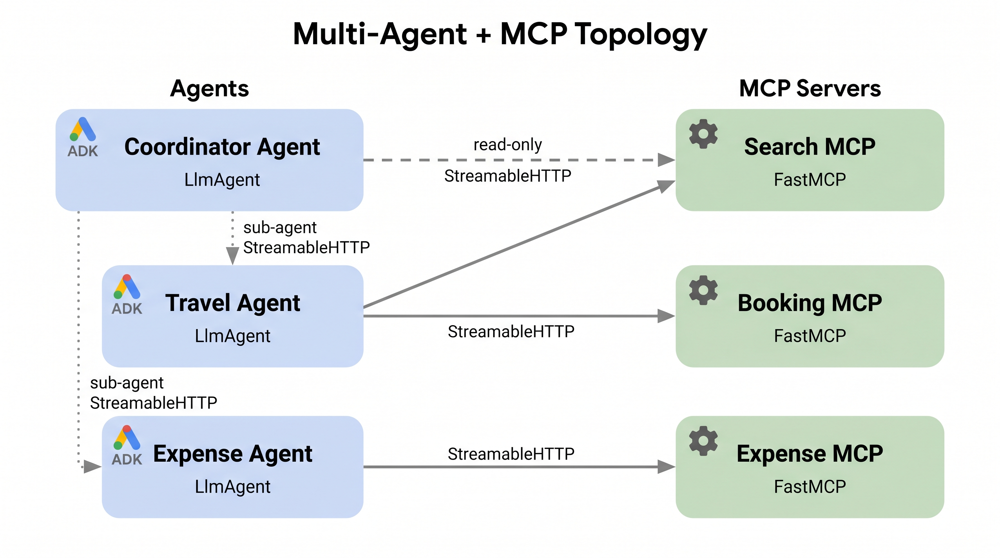 | Coordinator agent routing to travel and expense sub-agents with MCP tool servers |
| 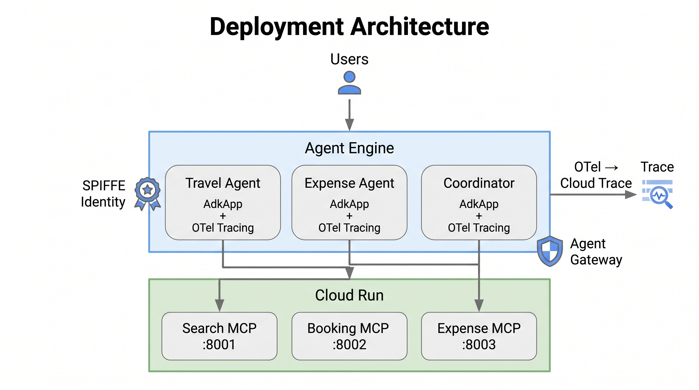 | Cloud Run MCP servers + Agent Runtime deployment topology |
| 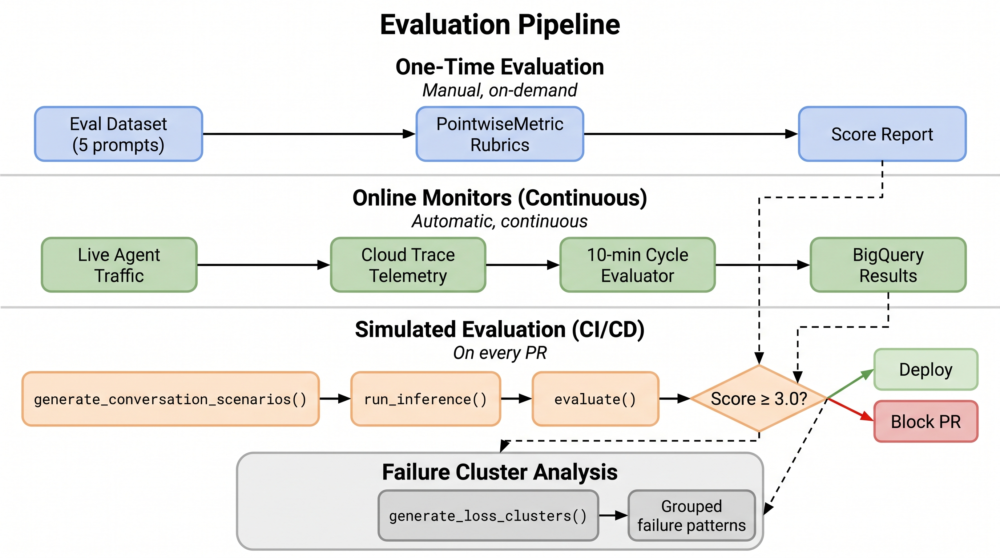 | Three-tier evaluation: one-time, continuous, and CI/CD simulated |
| 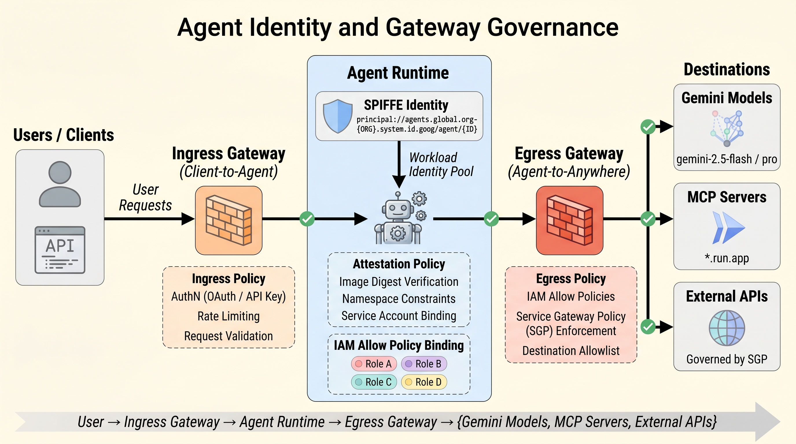 | SPIFFE identity, attestation policies, and Agent Gateway flow |
| 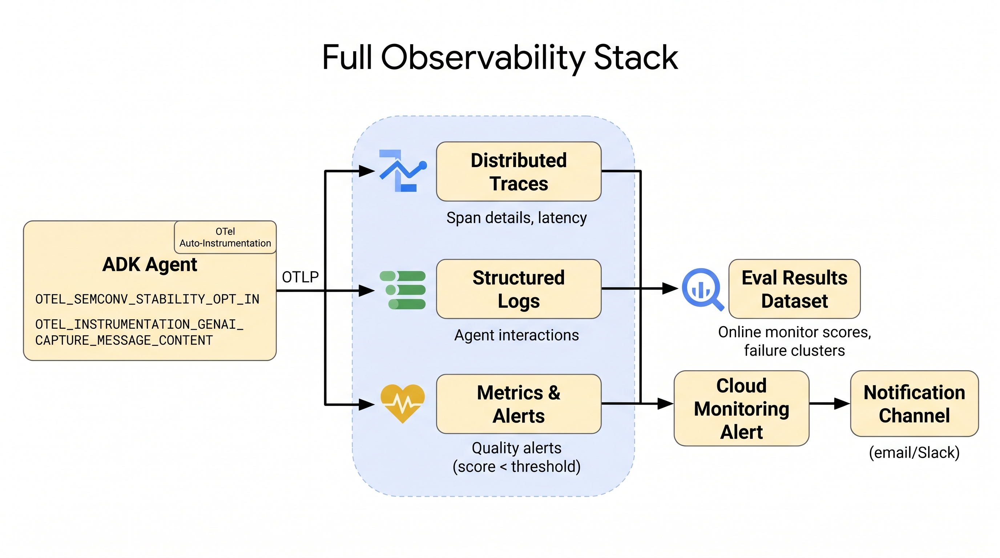 | OTel traces → Cloud Trace → BigQuery pipeline |
| 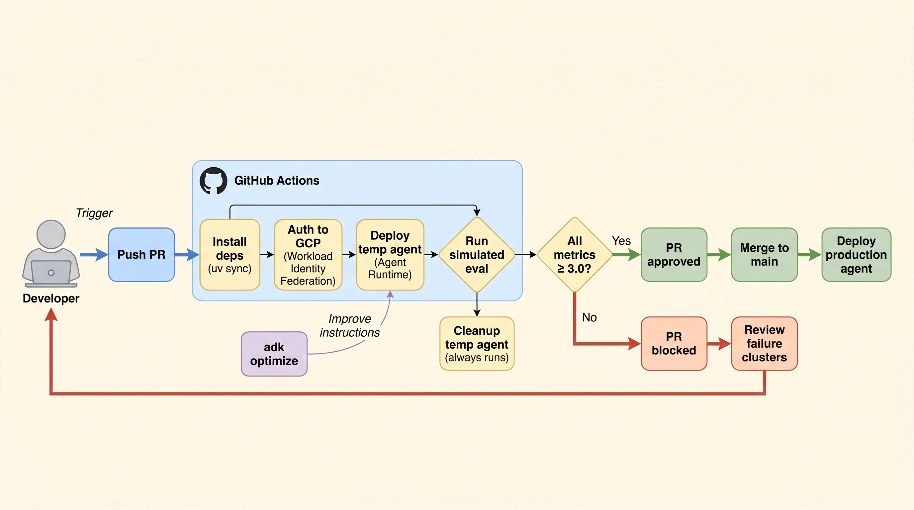 | GitHub Actions simulated eval gate on pull requests |
| 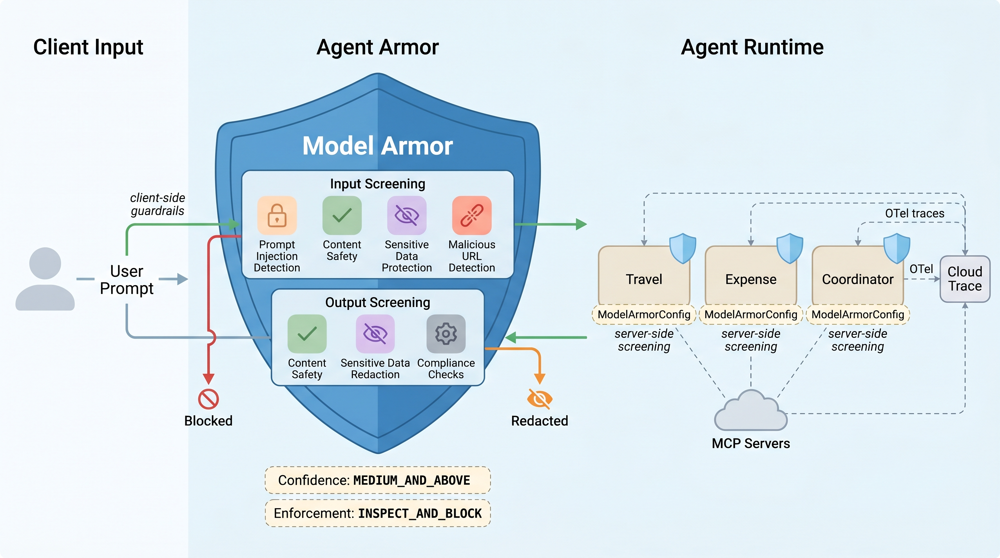 | Model Armor input/output screening with guardrail callbacks |

## Project Structure

```
src/
├── agents/          # ADK agent definitions
├── armor/           # Agent Armor — Model Armor config + guardrail callbacks
├── mcp_servers/     # FastMCP tool servers (search, booking, expense)
├── deploy/          # Deployment scripts for Cloud Run + Agent Runtime
├── eval/            # Evaluation pipeline (one-time, online, simulated)
├── optimize/        # Agent optimization (GEPA algorithm)
└── traffic/         # Traffic generation for OTel traces
scripts/             # Shell scripts for identity, gateway, registry setup
diagrams/            # Paper Banana architectural diagrams
docs/                # Workshop guide
tests/               # Unit and integration tests
```
