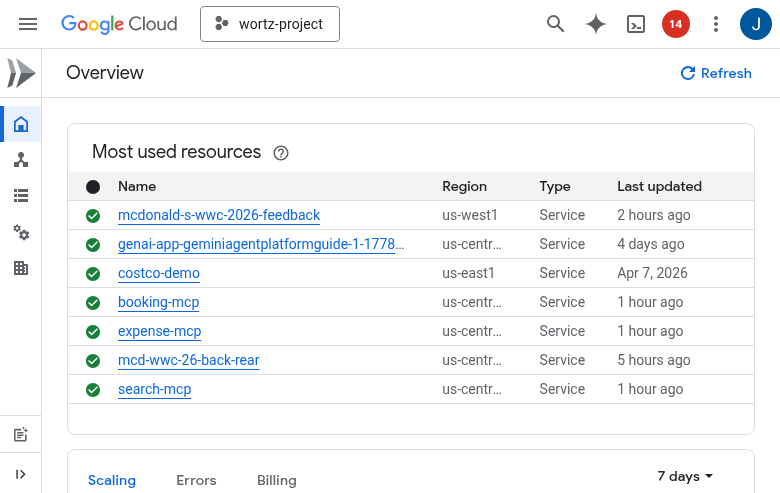

# GEAP Workshop: Enterprise Agent Platform Tour

A hands-on workshop demonstrating the full Gemini Enterprise Agent Platform (GEAP) — from building ADK agents with MCP tools through deployment, governance, evaluation, and optimization.

## What's Inside

| Area | Description |
|------|-------------|
| **ADK Agents** | Three agents (travel, expense, coordinator) built with Google Agent Development Kit |
| **MCP Servers** | Three FastMCP tool servers deployed to Cloud Run (search, booking, expense) |
| **Deployment** | Agent Runtime deployment with identity, gateway, and OTel tracing |
| **Evaluation** | One-time, continuous (online monitors), and simulated evaluation pipelines |
| **Agent Armor** | Model Armor templates for input/output screening + client-side guardrails |
| **Governance** | Agent identity (SPIFFE), agent gateway, agent registry |
| **Optimization** | Agent optimization via GEPA algorithm |
| **CI/CD** | GitHub Actions workflow running simulated evals on PRs |
| **Diagrams** | Architecture diagrams generated with Paper Banana |

## Quick Start

```bash
# Install dependencies
uv sync

# Copy and configure environment
cp .env.example .env
# Edit .env with your GCP project details

# Run tests
uv run pytest tests/

# Deploy everything in one command
bash scripts/deploy_all.sh
```

## Screenshots

All screenshots are captured from real deployed GCP resources:

| Screenshot | Feature |
|-----------|---------|
|  | GEAP architecture overview (Topology) |
|  | MCP servers on Cloud Run |
|  | Multi-agent deployment |
|  | Agent Gateway (ingress/egress) |
|  | Input/output screening |
|  | Three-tier eval pipeline |
|  | MCP servers in Agent Registry |
|  | Observability data pipeline |

## Workshop Guide

See [docs/workshop_guide.md](docs/workshop_guide.md) for the full workshop organized into 4 sessions:

| Session | Topic | Duration |
|---------|-------|----------|
| **Session 1** | AI Gateway / MCP Gateway | ~90 min |
| **Session 2** | AI Gateway / MCP Gateway (continued) | ~75 min |
| **Session 3** | Agent Registry | ~15 min |
| **Session 4** | Model Security / Model Armor | ~15 min |

## Architecture

```
┌─────────────────┐     ┌─────────────────┐     ┌─────────────────┐
│  Travel Agent   │     │  Expense Agent  │     │  Coordinator    │
│  (ADK LlmAgent) │     │  (ADK LlmAgent) │     │  (ADK LlmAgent) │
└────┬───────┬────┘     └────────┬────────┘     └────────┬────────┘
     │       │                   │                       │
     ▼       ▼                   ▼                       ▼
┌────────┐ ┌────────┐    ┌──────────┐             ┌────────┐
│ Search │ │Booking │    │ Expense  │             │ Search │
│  MCP   │ │  MCP   │    │   MCP    │             │  MCP   │
└────────┘ └────────┘    └──────────┘             └────────┘
     ↕           ↕             ↕                       ↕
            Cloud Run (StreamableHTTP)
```

## Project Structure

```
src/
├── agents/          # ADK agent definitions
├── armor/           # Agent Armor — Model Armor config + guardrail callbacks
├── mcp_servers/     # FastMCP tool servers (search, booking, expense)
├── deploy/          # Deployment scripts for Cloud Run + Agent Runtime
├── eval/            # Evaluation pipeline (one-time, online, simulated)
├── optimize/        # Agent optimization (GEPA algorithm)
└── traffic/         # Traffic generation for OTel traces
scripts/             # Shell scripts for identity, gateway, registry setup
diagrams/            # Paper Banana architectural diagrams
docs/                # Workshop guide
tests/               # Unit and integration tests
```
