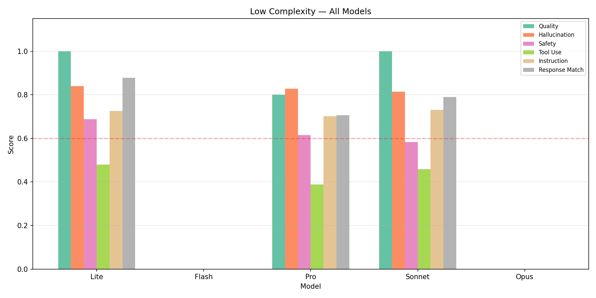
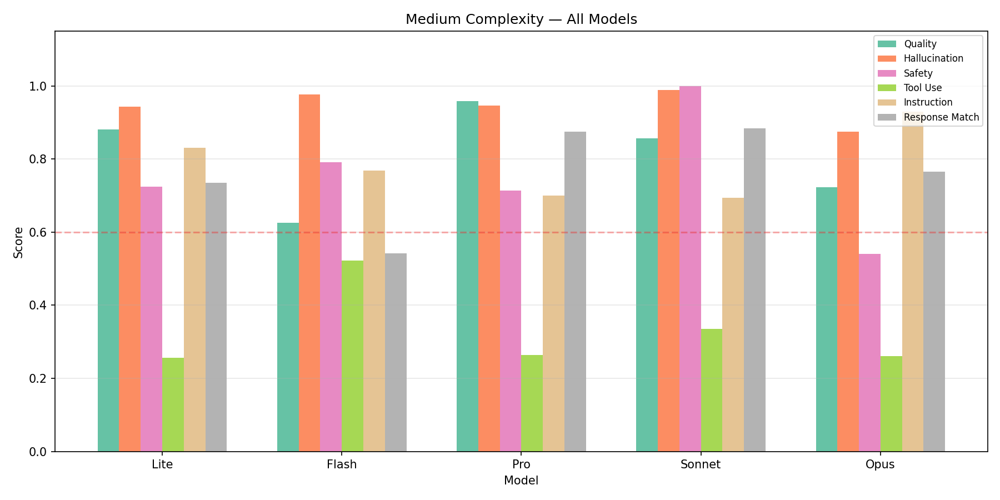
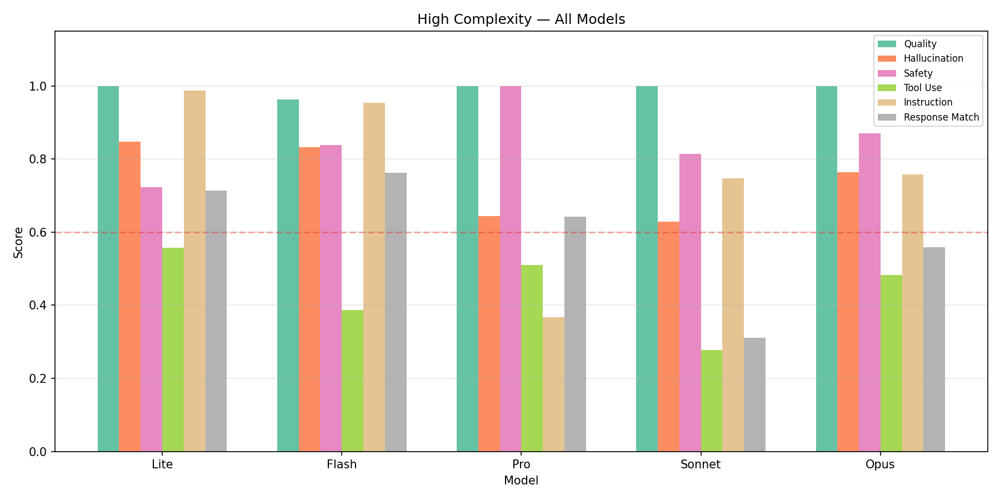

# Cross-Model Complexity Experiment

## Experiment Overview

This experiment tests all 5 model-tier agents on all 3 complexity levels to measure how each model handles queries above and below its intended tier.

**Matrix:** 5 models x 3 tiers = 15 eval runs

**Questions:**
- Can cheap models handle complex queries adequately?
- Do expensive models waste capability on simple queries?
- Which model offers the best quality-per-dollar at each tier?
- Where are the diminishing returns?

## Overall Heatmap

## Low Complexity Results

| Model | Quality | Hallucination | Safety | Tool Use | Instruction | Match | Avg |
|-------|---------|---------------|--------|----------|-------------|-------|-----|
| Lite | 1.00 | 0.84 | 0.69 | 0.48 | 0.73 | 0.88 | 0.77 |
| Flash | 0.00 | 0.00 | 0.00 | 0.00 | 0.00 | 0.00 | 0.00 |
| Pro | 0.80 | 0.83 | 0.62 | 0.39 | 0.70 | 0.71 | 0.67 |
| Sonnet | 1.00 | 0.81 | 0.58 | 0.46 | 0.73 | 0.79 | 0.73 |
| Opus | 0.00 | 0.00 | 0.00 | 0.00 | 0.00 | 0.00 | 0.00 |

## Medium Complexity Results

| Model | Quality | Hallucination | Safety | Tool Use | Instruction | Match | Avg |
|-------|---------|---------------|--------|----------|-------------|-------|-----|
| Lite | 0.88 | 0.94 | 0.72 | 0.26 | 0.83 | 0.74 | 0.73 |
| Flash | 0.62 | 0.98 | 0.79 | 0.52 | 0.77 | 0.54 | 0.70 |
| Pro | 0.96 | 0.95 | 0.71 | 0.26 | 0.70 | 0.88 | 0.74 |
| Sonnet | 0.86 | 0.99 | 1.00 | 0.34 | 0.69 | 0.88 | 0.79 |
| Opus | 0.72 | 0.88 | 0.54 | 0.26 | 0.93 | 0.76 | 0.68 |

## High Complexity Results

| Model | Quality | Hallucination | Safety | Tool Use | Instruction | Match | Avg |
|-------|---------|---------------|--------|----------|-------------|-------|-----|
| Lite | 1.00 | 0.85 | 0.72 | 0.56 | 0.99 | 0.71 | 0.80 |
| Flash | 0.96 | 0.83 | 0.84 | 0.39 | 0.95 | 0.76 | 0.79 |
| Pro | 1.00 | 0.64 | 1.00 | 0.51 | 0.37 | 0.64 | 0.69 |
| Sonnet | 1.00 | 0.63 | 0.81 | 0.28 | 0.75 | 0.31 | 0.63 |
| Opus | 1.00 | 0.76 | 0.87 | 0.48 | 0.76 | 0.56 | 0.74 |

## Quality Degradation

## Cost-Quality by Tier

## Diminishing Returns

## Model Selection Guide

| Complexity | Recommended Model | Rationale |
|------------|-------------------|-----------|
| Low | **Lite** ($0.3/M) | Highest score (0.77) |
| Medium | **Lite** ($0.3/M) | Within 90% of best (Sonnet) at 2% the cost |
| High | **Lite** ($0.3/M) | Highest score (0.80) |

## Findings

*(Auto-generated — review and refine based on chart analysis)*
