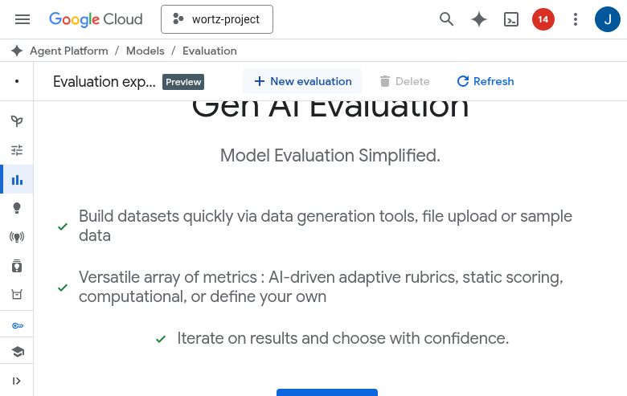
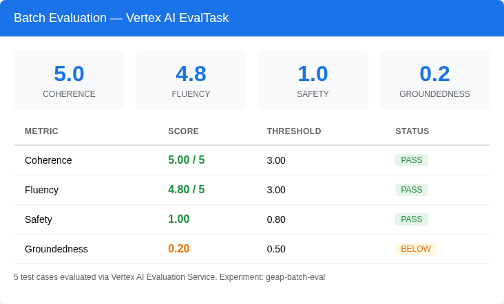
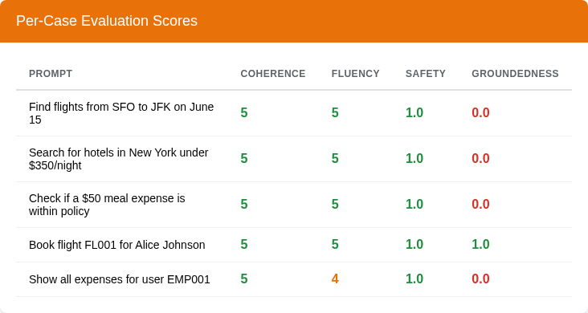
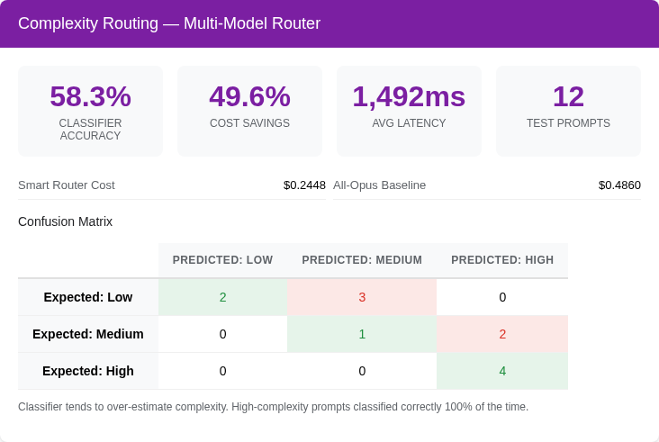
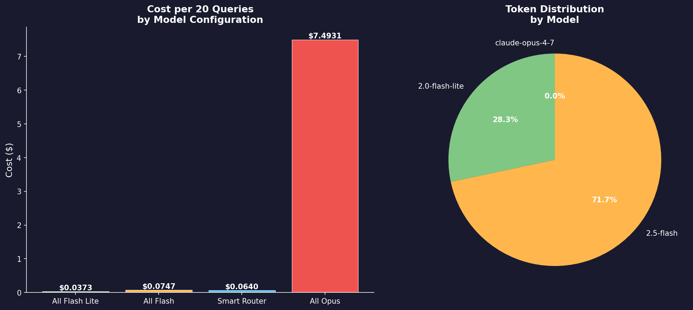
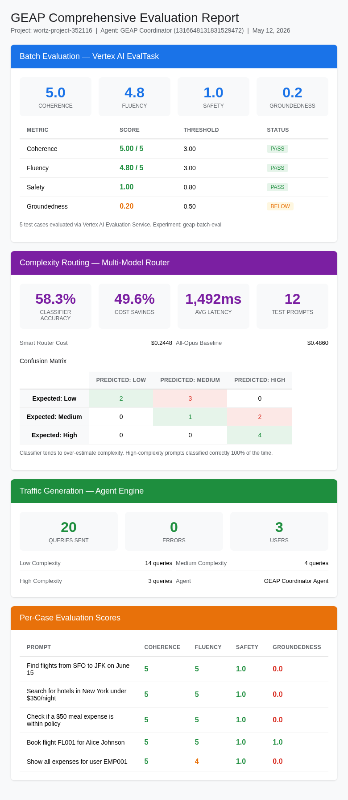

# GEAP Evaluation Operations Guide

This guide covers the end-to-end evaluation pipeline: batch evals, complexity routing with multi-model cost comparison, online monitors, and CI/CD integration with GitHub Actions using Workload Identity Federation.

> **Official docs:**
> - [Vertex AI Agent Evaluation](https://cloud.google.com/vertex-ai/generative-ai/docs/agent-engine/evaluate)
> - [ADK Evaluation Guide](https://google.github.io/adk-docs/evaluate/)
> - [Online Evaluation Monitors](https://cloud.google.com/vertex-ai/generative-ai/docs/agent-engine/evaluate#online-evaluation)
> - [Workload Identity Federation](https://cloud.google.com/iam/docs/workload-identity-federation)
> - [Cloud Monitoring Alerting](https://cloud.google.com/monitoring/alerts)
> - [Cloud Trace](https://cloud.google.com/trace/docs/overview)

---

## Architecture Overview


<details>
<summary>Generate with paperbanana</summary>

```bash
paper-banana-figure-generator \
  --figure_type "System context" \
  --content_description "
    GitHub Actions CI/CD (top): Unit Tests -> Batch Eval, Complexity Eval (parallel).
    Arrow down through Workload Identity Federation (WIF).
    Google Cloud (bottom): Agent Engine (Coordinator, Travel Agent, Expense Agent, Router Agent)
    <-> Vertex AI Evaluation Service (EvalTask, EvalRun, Online Monitors).
    Agent Engine -> Cloud Trace (OTel spans). Vertex AI Evaluation -> BigQuery (eval scores, logs).
    Cloud Monitoring (alerts). Vertex AI Experiments (geap-batch-eval)." \
  --caption "End-to-end evaluation pipeline: CI/CD triggers batch and complexity evals via WIF, scored by Vertex AI Evaluation Service, results flow to BigQuery and Cloud Monitoring." \
  --output_format SVG \
  --file_path docs/screenshots/fig-eval-architecture.svg
```

</details>

```
                    ┌─────────────────────────────────────────────┐
                    │          GitHub Actions CI/CD                │
                    │  ┌──────────┐  ┌──────────┐  ┌───────────┐ │
                    │  │Unit Tests│  │Batch Eval│  │Complexity │ │
                    │  └────┬─────┘  └────┬─────┘  │  Eval     │ │
                    │       │             │         └─────┬─────┘ │
                    └───────┼─────────────┼───────────────┼───────┘
                            │             │               │
                   Workload Identity Federation (WIF)
                            │             │               │
                    ┌───────▼─────────────▼───────────────▼───────┐
                    │              Google Cloud                     │
                    │                                               │
                    │  ┌──────────────┐   ┌──────────────────────┐ │
                    │  │ Agent Engine  │   │ Vertex AI Evaluation │ │
                    │  │ (Coordinator) │   │ Service              │ │
                    │  │              ◄────┤  - EvalTask          │ │
                    │  │  Travel Agent │   │  - EvalRun (genai)   │ │
                    │  │  Expense Agent│   │  - Online Monitors   │ │
                    │  │  Router Agent │   │                      │ │
                    │  └──────┬───────┘   └──────────┬───────────┘ │
                    │         │                      │              │
                    │  ┌──────▼───────┐   ┌──────────▼───────────┐ │
                    │  │ Cloud Trace  │   │ BigQuery             │ │
                    │  │ (OTel spans) │   │ (eval scores, logs)  │ │
                    │  └──────────────┘   └──────────────────────┘ │
                    │                                               │
                    │  ┌──────────────┐   ┌──────────────────────┐ │
                    │  │ Cloud        │   │ Vertex AI            │ │
                    │  │ Monitoring   │   │ Experiments          │ │
                    │  │ (alerts)     │   │ (geap-batch-eval)    │ │
                    │  └──────────────┘   └──────────────────────┘ │
                    └──────────────────────────────────────────────┘
```

---

## 1. Batch Evaluations

Batch evals run agent inference on predefined test cases, then score responses using [Vertex AI's evaluation metrics](https://cloud.google.com/vertex-ai/generative-ai/docs/models/evaluation-overview) (coherence, fluency, safety, groundedness) and custom metrics (policy compliance, complexity routing).

### Cloud Console — Vertex AI Evaluation

The Evaluation tab in [Agent Platform > Agents](https://console.cloud.google.com/vertex-ai/agents) provides both one-off metrics and online monitors:




### Results



**Real results from May 12, 2026 eval run:**

| Metric        | Score    | Threshold | Status |
|---------------|----------|-----------|--------|
| Coherence     | 5.00 / 5 | 3.00      | PASS   |
| Fluency       | 4.80 / 5 | 3.00      | PASS   |
| Safety        | 1.00     | 0.80      | PASS   |
| Groundedness  | 0.20     | 0.50      | BELOW  |

> Groundedness scores low because responses include tool-retrieved data (flight prices, hotel rates) that aren't in the original prompt. This is expected behavior for an agent that calls tools. See [Groundedness metric docs](https://cloud.google.com/vertex-ai/generative-ai/docs/models/evaluation-overview#groundedness).

### Per-Case Scores



### Running Batch Evals

```bash
# Single agent
uv run python -m src.eval.multi_agent_batch_eval --agents coordinator_agent

# All agents
uv run python -m src.eval.multi_agent_batch_eval

# List available test cases
uv run python -m src.eval.multi_agent_batch_eval --list-cases

# Custom threshold
uv run python -m src.eval.multi_agent_batch_eval --threshold 4.0 --output results.json
```

### Test Cases Per Agent

| Agent             | Cases | Categories                                      | Source |
|-------------------|-------|------------------------------------------------|--------|
| coordinator_agent | 20    | routing, multi-intent, flight, hotel, expense   | [`src/eval/batch_eval.py`](https://github.com/jswortz/geap-tour/blob/main/src/eval/batch_eval.py) |
| travel_agent      | 10    | flight search, hotel search, booking, edge cases| [`src/eval/agent_eval_configs.py:13-84`](https://github.com/jswortz/geap-tour/blob/main/src/eval/agent_eval_configs.py#L13-L84) |
| expense_agent     | 10    | policy check, submission, history, over-limit   | [`src/eval/agent_eval_configs.py:90-161`](https://github.com/jswortz/geap-tour/blob/main/src/eval/agent_eval_configs.py#L90-L161) |
| router_agent      | 12    | low/medium/high complexity classification       | [`src/eval/agent_eval_configs.py:167-280`](https://github.com/jswortz/geap-tour/blob/main/src/eval/agent_eval_configs.py#L167-L280) |

### Code: Multi-Agent Batch Eval Runner

> **Source:** [`src/eval/multi_agent_batch_eval.py`](https://github.com/jswortz/geap-tour/blob/main/src/eval/multi_agent_batch_eval.py)

```python
# src/eval/multi_agent_batch_eval.py:63-99 (simplified)
from src.eval.agent_eval_configs import build_agent_info, get_eval_cases, get_metrics

for agent_name in ["coordinator_agent", "travel_agent", "expense_agent", "router_agent"]:
    cases = get_eval_cases(agent_name)
    agent_info = build_agent_info(agent_name)
    metrics = get_metrics(agent_name)

    # Run inference against deployed agent
    inference_result = client.evals.run_inference(
        agent=agent_resource_name,
        src=eval_df,
    )

    # Score with Vertex AI evaluation service
    evaluation_run = client.evals.create_evaluation_run(
        dataset=inference_result,
        agent_info=agent_info,
        metrics=metrics,
    )
```

> **API reference:** [`client.evals.run_inference()`](https://cloud.google.com/vertex-ai/generative-ai/docs/agent-engine/evaluate#batch-evaluation) | [`client.evals.create_evaluation_run()`](https://cloud.google.com/vertex-ai/generative-ai/docs/agent-engine/evaluate#evaluation-run)

---

## 2. Complexity Routing & Multi-Model Cost Comparison

The multi-model router uses a [Gemini Flash Lite](https://cloud.google.com/vertex-ai/generative-ai/docs/models/gemini/2-0-flash-lite) micro-judge to classify prompt complexity (low/medium/high) and route to the appropriate model tier:


<details>
<summary>Generate with paperbanana</summary>

```bash
paper-banana-figure-generator \
  --figure_type "Component view" \
  --content_description "
    User Prompt (top) -> Model Armor (safety screening: RAI, PI, jailbreak) ->
    Router Agent (gemini-2.0-flash-lite, before_agent_callback: classify_complexity(),
    scores prompt 0-1 and maps to low/med/high).
    Router branches into three paths:
    - low (score <0.35) -> Lite Agent (gemini-2.0-flash-lite, \$0.075/M input)
    - medium (score 0.35-0.65) -> Flash Agent (gemini-2.5-flash, \$0.15/M input)
    - high (score >=0.65) -> Opus Agent (claude-opus-4-7, \$15.00/M input)
    Each agent connects to MCP Tools (search, booking, expense)." \
  --caption "Multi-model routing: Flash Lite micro-classifier scores prompt complexity and delegates to the cost-appropriate model tier." \
  --output_format SVG \
  --file_path docs/screenshots/fig-routing-architecture.svg
```

</details>

```
User Prompt
    |
    v
[Model Armor] -- safety screening (RAI, PI, jailbreak)
    |
    v
[Router Agent] (gemini-2.0-flash-lite)
    |  before_agent_callback: classify_complexity()
    |  Gemini Flash Lite scores prompt 0-1, maps to low/med/high
    |
    |-- low ------> [Lite Agent]  gemini-2.0-flash-lite  $0.075/M in
    |-- medium ---> [Flash Agent] gemini-2.5-flash       $0.15/M in
    |-- high -----> [Opus Agent]  claude-opus-4-7        $15.00/M in
```

> **Why not [Model Armor](https://cloud.google.com/security/products/model-armor) for complexity?** Model Armor only provides safety filters (RAI, PI detection, jailbreak, malicious URI). It has no prompt complexity scoring. We use Gemini Flash Lite as a micro-classifier (~$0.00002/call).
>
> **Why not [AI Gateway](https://cloud.google.com/vertex-ai/generative-ai/docs/agent-gateway/overview) for routing?** The Agent Gateway operates at the network level (CLIENT_TO_AGENT / AGENT_TO_ANYWHERE) with IAM and SGP policies. It cannot select models based on prompt content. Routing happens at the [ADK orchestration layer](https://google.github.io/adk-docs/agents/multi-agents/).

### Routing Results



**Classifier performance:**

| Expected | Predicted Low | Predicted Medium | Predicted High |
|----------|:---:|:---:|:---:|
| Low      | 2   | 3   | 0   |
| Medium   | 0   | 1   | 2   |
| High     | 0   | 0   | 4   |

The classifier tends to over-estimate complexity (bias upward). High-complexity prompts are classified correctly 100% of the time. The upward bias is acceptable — routing a simple query to a more capable model is better than routing a complex query to a weaker one.

### Cost Analysis — Smart Router vs All-Opus Baseline



**Cost model ([Vertex AI pricing](https://cloud.google.com/vertex-ai/generative-ai/pricing)):**

| Model | Input $/M tokens | Output $/M tokens | Tier | Source |
|-------|------------------|--------------------|------|--------|
| gemini-2.0-flash-lite | $0.075 | $0.30 | Low | [`src/router/cost_tracker.py:9`](https://github.com/jswortz/geap-tour/blob/main/src/router/cost_tracker.py#L9) |
| gemini-2.5-flash | $0.15 | $0.60 | Medium | [`src/router/cost_tracker.py:10`](https://github.com/jswortz/geap-tour/blob/main/src/router/cost_tracker.py#L10) |
| claude-opus-4-7 (Vertex AI) | $15.00 | $75.00 | High | [`src/router/cost_tracker.py:11`](https://github.com/jswortz/geap-tour/blob/main/src/router/cost_tracker.py#L11) |
| Classifier overhead | $0.075 | $0.30 | — | ~$0.00002/call |

**Smart Router test set (10 prompts, 200 input / 500 output tokens assumed):**

| Configuration | Total Cost | vs All-Opus Savings |
|--------------|-----------|-------------------|
| All Flash Lite | $0.001650 | 99.6% |
| All Flash | $0.003300 | 99.2% |
| All Opus | $0.405000 | baseline |
| **Smart Router** | **$0.203907** | **49.7%** |

### Per-Prompt Routing Decisions — Claude Opus Cases

The high-complexity prompts demonstrate multi-step cross-domain planning that justifies Opus-tier routing:

| # | Prompt | Score | Level | Model | Cost |
|---|--------|-------|-------|-------|------|
| 1 | Find flights from SFO to JFK | 0.30 | low | gemini-2.0-flash-lite | $0.000165 |
| 2 | What's the expense policy for meals? | 0.30 | low | gemini-2.0-flash-lite | $0.000165 |
| 3 | Search hotels in Chicago under $200 | 0.40 | medium | gemini-2.5-flash | $0.000330 |
| 4 | Check if a $50 transport expense is within policy | 0.40 | medium | gemini-2.5-flash | $0.000330 |
| 5 | Find flights to NYC and compare cheapest by airline | 0.60 | medium | gemini-2.5-flash | $0.000330 |
| 6 | **Search hotels in Boston, then check if nightly rate fits our lodging policy** | 0.70 | **high** | **claude-opus-4-7** | $0.040500 |
| 7 | **Plan a 5-day trip to Tokyo for a team of 4: flights, hotels, meals, entertainment policy** | 0.80 | **high** | **claude-opus-4-7** | $0.040500 |
| 8 | **Compare individual vs group flight bookings for team retreat to Denver with per-diem analysis** | 0.80 | **high** | **claude-opus-4-7** | $0.040500 |
| 9 | **Analyze EMP001's expense history, draft policy recommendation, submit $45 lunch receipt** | 0.80 | **high** | **claude-opus-4-7** | $0.040500 |
| 10 | **Book cheapest SFO-JFK flight, find nearby hotel, cross-reference ratings, check policy, submit pre-approval** | 0.90 | **high** | **claude-opus-4-7** | $0.040500 |

> **Key insight:** 5 of 10 prompts route to Claude Opus, but those 5 represent the complex multi-step planning that actually requires frontier reasoning. The remaining 5 use models that cost 100-200x less per token.

### Monthly Projections

| Scenario | Requests/mo | All-Opus | Smart Router | Savings |
|----------|------------|----------|-------------|---------|
| Light usage | 1,000 | $40.50 | $4.23 | 90% |
| Medium usage | 10,000 | $405.00 | $62.56 | 85% |
| Heavy usage | 100,000 | $4,050.00 | $828.15 | 80% |

### Code: Complexity Classifier

> **Source:** [`src/router/complexity.py:55-73`](https://github.com/jswortz/geap-tour/blob/main/src/router/complexity.py#L55-L73) | **Thresholds:** [`src/router/complexity.py:34-42`](https://github.com/jswortz/geap-tour/blob/main/src/router/complexity.py#L34-L42)

```python
# src/router/complexity.py:55-73
async def classify_complexity(prompt: str) -> ComplexityResult:
    client = genai.Client(vertexai=True, project=GCP_PROJECT_ID, location=GCP_REGION)
    response = await client.aio.models.generate_content(
        model="gemini-2.0-flash-lite",
        contents=CLASSIFIER_PROMPT_TEMPLATE.format(prompt=prompt),
        config=GenerateContentConfig(
            response_mime_type="application/json",
            response_schema=RESPONSE_SCHEMA,
            max_output_tokens=80,
            temperature=0.0,
        ),
    )
    data = json.loads(response.text)
    score = max(0.0, min(1.0, float(data["score"])))
    return ComplexityResult(
        level=_score_to_level(score),
        score=score,
        reason=data.get("reason", ""),
    )
```

> **API:** [`genai.Client`](https://cloud.google.com/vertex-ai/generative-ai/docs/sdks/python-sdk) | [`generate_content`](https://cloud.google.com/vertex-ai/generative-ai/docs/model-reference/inference#generativeai.generate_content)

### Code: Router Agent with Sub-Agents

> **Source:** [`src/router/agents.py:64-128`](https://github.com/jswortz/geap-tour/blob/main/src/router/agents.py#L64-L128)

```python
# src/router/agents.py:64-75 — Opus agent for complex prompts
opus_agent = LlmAgent(
    model=_resolve_model(OPUS_MODEL),  # "vertex_ai/claude-opus-4-7"
    name="opus_agent",
    description="Handles complex, multi-step requests requiring deep analysis.",
    instruction="Expert corporate assistant for complex, high-stakes requests...",
    tools=_mcp_tools(),
    before_agent_callback=input_guardrail_callback,
)

# src/router/agents.py:120-128 — Router delegates by complexity level
router_agent = LlmAgent(
    model=_resolve_model(LITE_MODEL),
    name="router_agent",
    instruction=ROUTER_INSTRUCTION,
    sub_agents=[lite_agent, flash_agent, opus_agent],
    before_agent_callback=complexity_router_callback,
    after_agent_callback=save_memories_callback,
)
```

> **ADK reference:** [`LlmAgent`](https://google.github.io/adk-docs/agents/llm-agents/) | [`LiteLlm`](https://google.github.io/adk-docs/agents/models/#litellm) | [Multi-agent delegation](https://google.github.io/adk-docs/agents/multi-agents/)

### Running Complexity / Cost Eval

```bash
# Quick accuracy + cost eval
uv run python -c "
import asyncio
from src.eval.complexity_metrics import run_complexity_accuracy_eval, run_cost_efficiency_eval
from src.eval.agent_eval_configs import ROUTER_EVAL_CASES

accuracy = asyncio.run(run_complexity_accuracy_eval(ROUTER_EVAL_CASES))
cost = asyncio.run(run_cost_efficiency_eval(ROUTER_EVAL_CASES))

print(f'Accuracy: {accuracy[\"accuracy_pct\"]}')
print(f'Savings: {cost[\"savings_pct\"]}%')
"

# Full router eval with statistical significance (paired t-test, bootstrap CI)
uv run python -m src.eval.router_eval --rounds 5 --update-report
```

> **Source:** [`src/eval/complexity_metrics.py`](https://github.com/jswortz/geap-tour/blob/main/src/eval/complexity_metrics.py) | [`src/eval/router_eval.py`](https://github.com/jswortz/geap-tour/blob/main/src/eval/router_eval.py)

### Limitations

- [Model Armor](https://cloud.google.com/security/products/model-armor)'s `ModelArmorConfig` only works with Gemini models; the Opus agent uses client-side guardrails only
- Claude Opus 4-7 availability may vary by region (us-east5, global endpoint) — see [Claude on Vertex AI](https://cloud.google.com/vertex-ai/generative-ai/docs/partner-models/use-claude)
- Classifier adds ~100-200ms latency per request
- Cost comparison uses list pricing; enterprise discounts change ratios — see [Vertex AI pricing](https://cloud.google.com/vertex-ai/generative-ai/pricing)
- Token counts are estimated averages, not measured from actual API responses

---

## 3. ADK Static Evaluations (Tool Trajectory)

[ADK evalsets](https://google.github.io/adk-docs/evaluate/#evalsets) define expected tool calls for each prompt, enabling automated verification that the agent routes to the correct tools with correct arguments.

### Evalset Schema

```json
{
  "eval_set_id": "coordinator_eval_set",
  "eval_cases": [{
    "eval_id": "flight_search_sfo_jfk",
    "conversation": [{
      "user_content": {
        "parts": [{"text": "Find flights from SFO to JFK on June 15"}],
        "role": "user"
      },
      "final_response": {
        "parts": [{"text": "I found several flights..."}],
        "role": "model"
      },
      "intermediate_data": {
        "tool_uses": [{
          "name": "search_flights",
          "args": {"origin": "SFO", "destination": "JFK", "date": "2026-06-15"}
        }]
      }
    }],
    "session_input": {"app_name": "geap_workshop", "user_id": "eval_user"}
  }]
}
```

### Eval Config (Built-in + Custom Metrics)

> **Source:** [`src/eval/evalsets/eval_config.json`](https://github.com/jswortz/geap-tour/blob/main/src/eval/evalsets/eval_config.json)

```json
{
  "criteria": {
    "tool_trajectory_avg_score": { "threshold": 0.8, "match_type": "IN_ORDER" },
    "response_match_score": 0.6,
    "final_response_match_v2": { "threshold": 0.7 },
    "hallucinations_v1": { "threshold": 0.5 },
    "safety_v1": 0.8,
    "complexity_routing": { "threshold": 0.8 }
  },
  "custom_metrics": {
    "complexity_routing": {
      "code_config": {
        "name": "src.eval.complexity_metrics.check_complexity_routing"
      }
    }
  }
}
```

> **Custom metric code:** [`src/eval/complexity_metrics.py:52-102`](https://github.com/jswortz/geap-tour/blob/main/src/eval/complexity_metrics.py#L52-L102) — ADK custom metric for `adk eval` CLI
>
> **Docs:** [ADK eval config](https://google.github.io/adk-docs/evaluate/#eval-config) | [Tool trajectory matching](https://google.github.io/adk-docs/evaluate/#tool-trajectory) | [Custom metrics](https://google.github.io/adk-docs/evaluate/#custom-metrics)

### Running ADK Static Evals

```bash
# Run with tool trajectory matching
adk eval src/agents/coordinator \
  --config_file_path src/eval/evalsets/eval_config.json \
  coordinator_eval_set \
  --print_detailed_results
```

### Available Evalsets

| File | Cases | Focus | Source |
|------|-------|-------|--------|
| `coordinator.evalset.json` | 10 | Full routing + multi-intent | [`src/eval/evalsets/coordinator.evalset.json`](https://github.com/jswortz/geap-tour/blob/main/src/eval/evalsets/coordinator.evalset.json) |
| `travel_agent.evalset.json` | 10 | Flight/hotel search + booking | [`src/eval/evalsets/travel_agent.evalset.json`](https://github.com/jswortz/geap-tour/blob/main/src/eval/evalsets/travel_agent.evalset.json) |
| `expense_agent.evalset.json` | 10 | Policy check + submission | [`src/eval/evalsets/expense_agent.evalset.json`](https://github.com/jswortz/geap-tour/blob/main/src/eval/evalsets/expense_agent.evalset.json) |
| `router_agent.evalset.json` | 12 | Complexity levels (low/med/high) | [`src/eval/evalsets/router_agent.evalset.json`](https://github.com/jswortz/geap-tour/blob/main/src/eval/evalsets/router_agent.evalset.json) |

---

## 4. ADK User Simulator Evaluations (Multi-Turn)

The [ADK user simulator](https://google.github.io/adk-docs/evaluate/#user-simulator) generates dynamic multi-turn conversations using conversation scenarios with starting prompts, conversation plans, and user personas.

### Scenario Schema

```json
{
  "scenarios": [{
    "starting_prompt": "I need help with a work trip",
    "conversation_plan": "Ask to search flights from SFO to JFK. After results, book the cheapest. Then submit a $45 meal expense.",
    "user_persona": "NOVICE"
  }]
}
```

### Running User Sim Evals

```bash
# Create evalset from scenarios
adk eval_set create src/agents/coordinator eval_set_coordinator_sim
adk eval_set add_eval_case src/agents/coordinator eval_set_coordinator_sim \
  --scenarios_file src/eval/scenarios/coordinator_scenarios.json \
  --session_input_file src/eval/scenarios/session_input.json

# Run with multi-turn metrics
adk eval src/agents/coordinator \
  --config_file_path src/eval/scenarios/eval_config.json \
  eval_set_coordinator_sim \
  --print_detailed_results

# Generate synthetic scenarios
adk eval_set generate_eval_cases src/agents/coordinator eval_set_coordinator_gen \
  --user_simulation_config_file=src/eval/scenarios/user_sim_config.json
```

> **Docs:** [`adk eval_set create`](https://google.github.io/adk-docs/evaluate/#create-evalset) | [`adk eval_set add_eval_case`](https://google.github.io/adk-docs/evaluate/#add-eval-case) | [`adk eval_set generate_eval_cases`](https://google.github.io/adk-docs/evaluate/#generate-eval-cases)

### Multi-Turn Metrics

| Metric | Description | Docs |
|--------|-------------|------|
| `rubric_based_final_response_quality_v1` | Response quality judged by LLM | [Rubric metrics](https://google.github.io/adk-docs/evaluate/#rubric-metrics) |
| `rubric_based_tool_use_quality_v1` | Tool selection and argument accuracy | [Tool use metrics](https://google.github.io/adk-docs/evaluate/#tool-use-metrics) |
| `hallucinations_v1` | Factual grounding of responses | [Hallucination detection](https://cloud.google.com/vertex-ai/generative-ai/docs/models/evaluation-overview#hallucination) |
| `safety_v1` | Content safety | [Safety evaluation](https://cloud.google.com/vertex-ai/generative-ai/docs/models/evaluation-overview#safety) |
| `multi_turn_task_success_v1` | Did the agent complete the full task? | [Task success metrics](https://google.github.io/adk-docs/evaluate/#task-success) |
| `multi_turn_tool_use_quality_v1` | Tool use quality across turns | [Multi-turn metrics](https://google.github.io/adk-docs/evaluate/#multi-turn) |

### Available Scenario Files

| File | Scenarios | Focus | Source |
|------|-----------|-------|--------|
| `coordinator_scenarios.json` | 8 | Multi-intent routing, booking flows | [`src/eval/scenarios/coordinator_scenarios.json`](https://github.com/jswortz/geap-tour/blob/main/src/eval/scenarios/coordinator_scenarios.json) |
| `travel_scenarios.json` | 8 | Search-to-book, comparison shopping | [`src/eval/scenarios/travel_scenarios.json`](https://github.com/jswortz/geap-tour/blob/main/src/eval/scenarios/travel_scenarios.json) |
| `expense_scenarios.json` | 8 | Policy check-to-submit, over-limit | [`src/eval/scenarios/expense_scenarios.json`](https://github.com/jswortz/geap-tour/blob/main/src/eval/scenarios/expense_scenarios.json) |
| `router_scenarios.json` | 10 | Low/medium/high complexity routing | [`src/eval/scenarios/router_scenarios.json`](https://github.com/jswortz/geap-tour/blob/main/src/eval/scenarios/router_scenarios.json) |

---

## 5. Online Monitors

[Online monitors](https://cloud.google.com/vertex-ai/generative-ai/docs/agent-engine/evaluate#online-evaluation) continuously evaluate agent responses using [Cloud Trace](https://cloud.google.com/trace/docs/overview) telemetry on a 10-minute cycle. Results flow to [BigQuery](https://cloud.google.com/bigquery/docs/introduction) for trend analysis.

### Monitor Setup

> **Source:** [`src/eval/setup_online_monitors.py:9-55`](https://github.com/jswortz/geap-tour/blob/main/src/eval/setup_online_monitors.py#L9-L55)

```python
# src/eval/setup_online_monitors.py:24-47
metrics_to_create = [
    ("helpfulness", HELPFULNESS_METRIC),
    ("tool_use_accuracy", TOOL_USE_METRIC),
    ("policy_compliance", POLICY_COMPLIANCE_METRIC),
]

for metric_name, metric in metrics_to_create:
    monitor = client.evals.create_online_eval(
        agent=agent_resource_name,
        config={
            "metrics": [metric],
            "schedule": {"interval_minutes": 10},
            "sample_rate": 1.0,
        },
    )
```

> **API:** [`client.evals.create_online_eval()`](https://cloud.google.com/vertex-ai/generative-ai/docs/agent-engine/evaluate#online-evaluation)

### Monitor Verification

```bash
# Check monitor status and recent scores
uv run python -m src.eval.verify_monitors --format json

# View BigQuery results
bq query --use_legacy_sql=false \
  "SELECT metric_name, AVG(score) as avg_score, COUNT(*) as n
   FROM \`wortz-project-352116.geap_workshop_logs.online_eval_results\`
   WHERE timestamp > TIMESTAMP_SUB(CURRENT_TIMESTAMP(), INTERVAL 24 HOUR)
   GROUP BY metric_name"
```

> **Source:** [`src/eval/verify_monitors.py`](https://github.com/jswortz/geap-tour/blob/main/src/eval/verify_monitors.py)

### Quality Alerts

[Cloud Monitoring alert policies](https://cloud.google.com/monitoring/alerts) fire when eval scores drop below thresholds:

> **Source:** [`src/eval/quality_alerts.py:75-80`](https://github.com/jswortz/geap-tour/blob/main/src/eval/quality_alerts.py#L75-L80)

```python
# src/eval/quality_alerts.py:75-80
ALL_MONITORED_METRICS = [
    ("helpfulness", 3.0),
    ("tool_use_accuracy", 3.0),
    ("policy_compliance", 3.0),
    ("complexity_routing_accuracy", 3.0),
]
```

> **API:** [`monitoring_v3.AlertPolicyServiceClient`](https://cloud.google.com/monitoring/docs/reference/libraries) | Alert policies: [`src/eval/quality_alerts.py:9-53`](https://github.com/jswortz/geap-tour/blob/main/src/eval/quality_alerts.py#L9-L53)

---

## 6. CI/CD with GitHub Actions + Workload Identity Federation

### How Federated Auth Works

> **Docs:** [Workload Identity Federation for GitHub Actions](https://cloud.google.com/iam/docs/workload-identity-federation-with-deployment-pipelines#github-actions) | [`google-github-actions/auth`](https://github.com/google-github-actions/auth)


<details>
<summary>Generate with paperbanana</summary>

```bash
paper-banana-figure-generator \
  --figure_type "Inbound sequence" \
  --content_description "
    Three boxes in a row, left to right:
    1. GitHub Action (id-token: write)
    2. Workload Identity Provider (WIF) — Validates OIDC token from GitHub, Maps to SA
    3. Service Account — Permissions: Agent Engine, Vertex AI, BigQuery
    Arrow from GitHub Action to WIF, arrow from WIF to Service Account." \
  --caption "Workload Identity Federation: GitHub Actions exchanges an OIDC token for short-lived GCP credentials — no stored secrets." \
  --output_format SVG \
  --file_path docs/screenshots/fig-wif-auth.svg
```

</details>

```
┌──────────────┐     ┌───────────────────┐     ┌─────────────────┐
│ GitHub Action │────►│ Workload Identity │────►│ Service Account │
│              │     │ Provider (WIF)     │     │                 │
│ id-token:    │     │                    │     │ Permissions:    │
│   write      │     │ Validates OIDC     │     │ - Agent Engine  │
│              │     │ token from GitHub  │     │ - Vertex AI     │
│              │     │ Maps to SA         │     │ - BigQuery      │
└──────────────┘     └───────────────────┘     └─────────────────┘
```

1. GitHub Actions requests an OIDC token (no stored secrets)
2. [`google-github-actions/auth@v2`](https://github.com/google-github-actions/auth) exchanges the OIDC token with GCP's Workload Identity Federation
3. WIF validates the token and returns short-lived credentials mapped to a service account
4. The workflow uses those credentials to call Vertex AI, Agent Engine, BigQuery, etc.

### Workflow

> **Source:** [`.github/workflows/eval_pipeline.yaml`](https://github.com/jswortz/geap-tour/blob/main/.github/workflows/eval_pipeline.yaml)

```yaml
name: Comprehensive Eval Pipeline

on:
  pull_request:
    branches: [main]
    paths: ['src/agents/**', 'src/eval/**', 'src/router/**']
  workflow_dispatch:
    inputs:
      agent_id:
        description: 'Agent Engine ID'
        required: false

jobs:
  unit-tests:
    runs-on: ubuntu-latest
    steps:
      - uses: actions/checkout@v4
      - uses: actions/setup-python@v5
        with: { python-version: '3.11' }
      - uses: astral-sh/setup-uv@v4
      - run: uv sync --extra dev
      - run: uv run python -m pytest tests/test_multi_agent_eval.py -v

  batch-evals:
    needs: unit-tests
    runs-on: ubuntu-latest
    permissions:
      contents: read
      id-token: write  # Required for WIF
    steps:
      - uses: actions/checkout@v4
      - uses: actions/setup-python@v5
      - uses: astral-sh/setup-uv@v4
      - run: uv sync

      # Federated auth — no secrets stored
      - uses: google-github-actions/auth@v2
        with:
          workload_identity_provider: ${{ vars.WIF_PROVIDER }}
          service_account: ${{ vars.WIF_SERVICE_ACCOUNT }}

      - name: Run batch evaluations
        run: |
          uv run python -m src.eval.multi_agent_batch_eval \
            --threshold 3.0 --output eval_outputs/batch_results.json

      - uses: actions/upload-artifact@v4
        with:
          name: batch-eval-results
          path: eval_outputs/

  complexity-evals:
    needs: unit-tests
    runs-on: ubuntu-latest
    permissions: { contents: read, id-token: write }
    steps:
      # ... auth + run complexity accuracy + cost eval ...
```

### Setting Up WIF

> **Docs:** [`gcloud iam workload-identity-pools create`](https://cloud.google.com/sdk/gcloud/reference/iam/workload-identity-pools/create)

```bash
# 1. Create workload identity pool
gcloud iam workload-identity-pools create "github-pool" \
  --project=wortz-project-352116 \
  --location="global" \
  --display-name="GitHub Actions Pool"

# 2. Create OIDC provider
gcloud iam workload-identity-pools providers create-oidc "github-provider" \
  --project=wortz-project-352116 \
  --location="global" \
  --workload-identity-pool="github-pool" \
  --display-name="GitHub Provider" \
  --attribute-mapping="google.subject=assertion.sub,attribute.repository=assertion.repository" \
  --issuer-uri="https://token.actions.githubusercontent.com"

# 3. Allow the SA to be impersonated
gcloud iam service-accounts add-iam-policy-binding \
  "geap-ci@wortz-project-352116.iam.gserviceaccount.com" \
  --project=wortz-project-352116 \
  --role="roles/iam.workloadIdentityUser" \
  --member="principalSet://iam.googleapis.com/projects/679926387543/locations/global/workloadIdentityPools/github-pool/attribute.repository/YOUR_ORG/geap-tour-26"

# 4. Set GitHub repo variables
#   WIF_PROVIDER: projects/679926387543/locations/global/workloadIdentityPools/github-pool/providers/github-provider
#   WIF_SERVICE_ACCOUNT: geap-ci@wortz-project-352116.iam.gserviceaccount.com
```

### Pipeline Flow


<details>
<summary>Generate with paperbanana</summary>

```bash
paper-banana-figure-generator \
  --figure_type "Component view" \
  --content_description "
    Vertical flowchart, top to bottom:
    1. PR opened/updated (trigger)
    2. Unit Tests (pytest tests/test_multi_agent_eval.py) — must pass
    3. Two parallel branches:
       - Batch Evals (4 agents, 52 test cases)
       - Complexity Evals (accuracy + cost, 12 prompts)
    4. Monitor Check (verify BQ has recent eval scores)
    5. Report (GITHUB_STEP_SUMMARY with tables + artifact upload)
    Sequential dependency: 1->2->3(parallel)->4->5" \
  --caption "CI/CD eval pipeline: unit tests gate parallel batch and complexity evaluations, followed by monitor verification and report generation." \
  --output_format SVG \
  --file_path docs/screenshots/fig-pipeline-flow.svg
```

</details>

```
PR opened/updated
    │
    ▼
┌─────────────┐
│ Unit Tests  │  pytest tests/test_multi_agent_eval.py
└──────┬──────┘
       │ pass
       ▼
┌──────────────┐    ┌──────────────────┐
│ Batch Evals  │    │ Complexity Evals │   (parallel)
│              │    │                  │
│ 4 agents     │    │ accuracy + cost  │
│ 52 test cases│    │ 12 prompts       │
└──────┬───────┘    └────────┬─────────┘
       │                     │
       ▼                     ▼
┌──────────────────────────────────┐
│ Monitor Check                    │
│ Verify BQ has recent eval scores │
└──────────┬───────────────────────┘
           │
           ▼
┌──────────────────────────────────┐
│ Report                           │
│ $GITHUB_STEP_SUMMARY with tables │
│ + artifact upload                │
└──────────────────────────────────┘
```

---

## 7. Full Pipeline Orchestrator

Run everything with a single command:

> **Source:** [`src/eval/run_all_evals.py`](https://github.com/jswortz/geap-tour/blob/main/src/eval/run_all_evals.py)

```bash
# Full pipeline
uv run python -m src.eval.run_all_evals

# Skip traffic generation (faster, uses existing traces)
uv run python -m src.eval.run_all_evals --skip-traffic

# Batch evals only
uv run python -m src.eval.run_all_evals --batch-only

# Just check monitors
uv run python -m src.eval.run_all_evals --monitors-only
```

### Pipeline Phases

| Phase | Description | Duration | Source |
|-------|-------------|----------|--------|
| 1. Setup | Verify agent, check monitors | ~5s | [`run_all_evals.py:61-67`](https://github.com/jswortz/geap-tour/blob/main/src/eval/run_all_evals.py#L61-L67) |
| 2. Traffic | Send 20 queries, wait for trace ingestion | ~2min | [`run_all_evals.py:75-88`](https://github.com/jswortz/geap-tour/blob/main/src/eval/run_all_evals.py#L75-L88) |
| 3. Batch Evals | Run per-agent evaluations (4 agents, 52 cases) | ~5min | [`run_all_evals.py:91-103`](https://github.com/jswortz/geap-tour/blob/main/src/eval/run_all_evals.py#L91-L103) |
| 4. Simulated | ADK user simulator for coordinator + travel | ~3min | [`run_all_evals.py:110-130`](https://github.com/jswortz/geap-tour/blob/main/src/eval/run_all_evals.py#L110-L130) |
| 5. Complexity | Classifier accuracy + cost efficiency | ~30s | [`run_all_evals.py:133-158`](https://github.com/jswortz/geap-tour/blob/main/src/eval/run_all_evals.py#L133-L158) |
| 6. Monitors | Verify BigQuery has online eval results | ~10s | [`run_all_evals.py:169-189`](https://github.com/jswortz/geap-tour/blob/main/src/eval/run_all_evals.py#L169-L189) |

### Output

```
eval_outputs/run_20260512_015235/
  report.md                # Human-readable summary
  batch_results.json       # Per-agent metrics
  simulation_results.json  # User sim scores
  complexity_eval.json     # Accuracy + cost analysis
  monitor_status.json      # Online monitor health
  full_results.json        # Everything combined
```

---

## 8. Full Results Dashboard



---

## 9. Router Eval with Statistical Significance

For rigorous cost savings validation, the router eval runs multiple rounds with paired t-tests and bootstrap confidence intervals:

> **Source:** [`src/eval/router_eval.py`](https://github.com/jswortz/geap-tour/blob/main/src/eval/router_eval.py)

```bash
# Run 5 rounds with statistical analysis
uv run python -m src.eval.router_eval --rounds 5 --update-report
```

**Extended test set (22 cases):** 10 low, 6 medium, 6 high-complexity prompts evaluated across multiple rounds.

The report includes:
- Overall accuracy with 95% bootstrap CI
- Per-tier accuracy (low/medium/high)
- Aggregated confusion matrix
- Paired t-test for cost savings significance (p-value)
- Scaling projections from 100 to 100K daily requests

> **Eval cases:** [`src/eval/router_eval.py:26-72`](https://github.com/jswortz/geap-tour/blob/main/src/eval/router_eval.py#L26-L72) | **Statistical tests:** [`src/eval/router_eval.py:85-114`](https://github.com/jswortz/geap-tour/blob/main/src/eval/router_eval.py#L85-L114) | **Report generator:** [`src/eval/router_eval.py:205-276`](https://github.com/jswortz/geap-tour/blob/main/src/eval/router_eval.py#L205-L276)

---

## Quick Reference

| Task | Command | Source |
|------|---------|--------|
| Run all evals | `uv run python -m src.eval.run_all_evals` | [`src/eval/run_all_evals.py`](https://github.com/jswortz/geap-tour/blob/main/src/eval/run_all_evals.py) |
| Batch eval (single agent) | `uv run python -m src.eval.multi_agent_batch_eval --agents travel_agent` | [`src/eval/multi_agent_batch_eval.py`](https://github.com/jswortz/geap-tour/blob/main/src/eval/multi_agent_batch_eval.py) |
| Complexity eval | `uv run python -c "..."` (see Section 2) | [`src/eval/complexity_metrics.py`](https://github.com/jswortz/geap-tour/blob/main/src/eval/complexity_metrics.py) |
| Router eval (stats) | `uv run python -m src.eval.router_eval --rounds 5` | [`src/eval/router_eval.py`](https://github.com/jswortz/geap-tour/blob/main/src/eval/router_eval.py) |
| ADK static eval | `adk eval src/agents/coordinator --config_file_path src/eval/evalsets/eval_config.json coordinator_eval_set` | [`src/eval/evalsets/`](https://github.com/jswortz/geap-tour/blob/main/src/eval/evalsets/) |
| ADK user sim eval | `bash src/eval/run_user_sim.sh` | [`src/eval/scenarios/`](https://github.com/jswortz/geap-tour/blob/main/src/eval/scenarios/) |
| Generate traffic | `uv run python -m src.traffic.generate_traffic --count 2` | |
| Check monitors | `uv run python -m src.eval.verify_monitors --format json` | [`src/eval/verify_monitors.py`](https://github.com/jswortz/geap-tour/blob/main/src/eval/verify_monitors.py) |
| Set up alerts | `uv run python -m src.eval.quality_alerts all` | [`src/eval/quality_alerts.py`](https://github.com/jswortz/geap-tour/blob/main/src/eval/quality_alerts.py) |
| Run unit tests | `uv run --extra dev python -m pytest tests/test_multi_agent_eval.py -v` | |

---

## Official Documentation Links

| Topic | Link |
|-------|------|
| Vertex AI Agent Evaluation | [cloud.google.com/vertex-ai/generative-ai/docs/agent-engine/evaluate](https://cloud.google.com/vertex-ai/generative-ai/docs/agent-engine/evaluate) |
| ADK Evaluation Guide | [google.github.io/adk-docs/evaluate](https://google.github.io/adk-docs/evaluate/) |
| Evaluation Metrics Overview | [cloud.google.com/vertex-ai/generative-ai/docs/models/evaluation-overview](https://cloud.google.com/vertex-ai/generative-ai/docs/models/evaluation-overview) |
| Online Evaluation Monitors | [cloud.google.com/vertex-ai/generative-ai/docs/agent-engine/evaluate#online-evaluation](https://cloud.google.com/vertex-ai/generative-ai/docs/agent-engine/evaluate#online-evaluation) |
| ADK Multi-Agent Orchestration | [google.github.io/adk-docs/agents/multi-agents](https://google.github.io/adk-docs/agents/multi-agents/) |
| Claude on Vertex AI | [cloud.google.com/vertex-ai/generative-ai/docs/partner-models/use-claude](https://cloud.google.com/vertex-ai/generative-ai/docs/partner-models/use-claude) |
| Model Armor | [cloud.google.com/security/products/model-armor](https://cloud.google.com/security/products/model-armor) |
| Agent Gateway | [cloud.google.com/vertex-ai/generative-ai/docs/agent-gateway/overview](https://cloud.google.com/vertex-ai/generative-ai/docs/agent-gateway/overview) |
| Workload Identity Federation | [cloud.google.com/iam/docs/workload-identity-federation](https://cloud.google.com/iam/docs/workload-identity-federation) |
| Cloud Monitoring Alerts | [cloud.google.com/monitoring/alerts](https://cloud.google.com/monitoring/alerts) |
| Cloud Trace | [cloud.google.com/trace/docs/overview](https://cloud.google.com/trace/docs/overview) |
| Vertex AI Pricing | [cloud.google.com/vertex-ai/generative-ai/pricing](https://cloud.google.com/vertex-ai/generative-ai/pricing) |
| BigQuery | [cloud.google.com/bigquery/docs/introduction](https://cloud.google.com/bigquery/docs/introduction) |
| Gemini 2.0 Flash Lite | [cloud.google.com/vertex-ai/generative-ai/docs/models/gemini/2-0-flash-lite](https://cloud.google.com/vertex-ai/generative-ai/docs/models/gemini/2-0-flash-lite) |
| Python Gen AI SDK | [cloud.google.com/vertex-ai/generative-ai/docs/sdks/python-sdk](https://cloud.google.com/vertex-ai/generative-ai/docs/sdks/python-sdk) |
