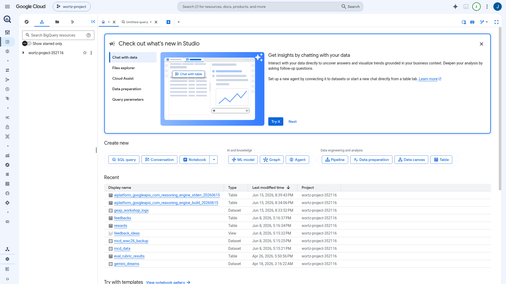
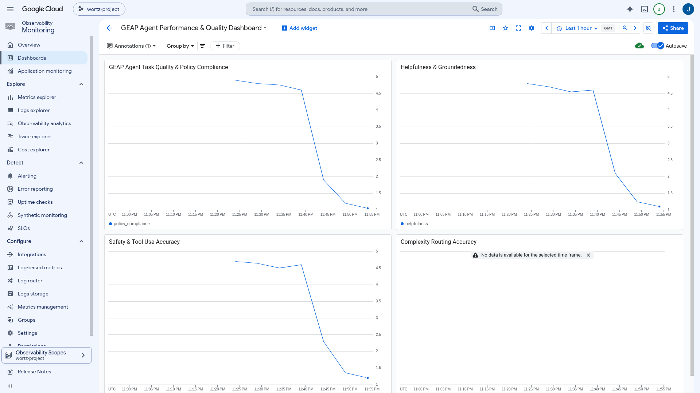

# GEAP Agent Evaluation — End-to-End Demo Walkthrough

This is the guided, teach-me walkthrough for evaluating and optimizing agents on the
**Gemini Enterprise Agent Platform (GEAP)**. It maps 1:1 to Google's
**[Optimize → Evaluation](https://docs.cloud.google.com/gemini-enterprise-agent-platform/optimize/evaluation/agent-evaluation)**
documentation and drives the demo package in [`src/eval/demo/`](../src/eval/demo).

Every step below links to (a) the official doc page it teaches and (b) the repo artifact that
runs it. For the full coverage matrix see [`eval_operations.md` §0](eval_operations.md#0-geap-optimize--evaluation-coverage-matrix).

- **Run everything (live):** `uv run python -m src.eval.demo.full_eval_demo --agent-id $AGENT_ENGINE_ID`
- **Notebook (with `.show()` visualizations):** `jupyter notebook src/eval/demo/evaluation_demo.ipynb`
- **Emit JSON for reports/screenshots:** add `--emit-json eval_outputs/demo/full_demo.json`

---

## The Quality Flywheel

The GEAP docs frame evaluation as a continuous **Quality Flywheel** — four phases run as a
six-step loop. The demo executes the loop end-to-end:

| Phase | Steps | Demo module |
|-------|-------|-------------|
| **Design** | 1. Define eval cases · 2. (plan user simulation) | `agent_eval_configs.py`, `simulated_eval.py` |
| **Execution** | 3. Run inferences → generate traces | `multi_agent_batch_eval.py`, `simulated_eval.py`, `offline_trace_eval.py` |
| **Scoring** | 4. Compute metrics | `metric_registry.py`, `agent_eval_configs.get_metrics` |
| **Refinement** | 5. Analyze → 6. Optimize | `failure_clusters.py`, `loss_taxonomy.py`, `sdk_optimize.py`, `run_optimize.py` |


---

## Phase 1 — Design: define eval cases and metrics

### 1a. Define eval cases
📖 [agent-evaluation](https://docs.cloud.google.com/gemini-enterprise-agent-platform/optimize/evaluation/agent-evaluation)
· 🛠️ [`src/eval/agent_eval_configs.py`](../src/eval/agent_eval_configs.py)

An **eval case** specifies an agent task and expected outcome. GEAP distinguishes
**reference-based** metrics (need a reference answer, e.g. Exact Match) from **reference-free**
metrics (judge the trace on its own, e.g. rubric quality). The repo defines per-agent case lists
(coordinator 20, travel 10, expense 10, router 12) plus `build_agent_info()` so evaluation runs
offline without live MCP connections.

### 1b. Choose / register metrics
📖 [manage-metrics](https://docs.cloud.google.com/gemini-enterprise-agent-platform/optimize/evaluation/manage-metrics)
· 🛠️ [`src/eval/metric_registry.py`](../src/eval/metric_registry.py)

The **Metric Registry** lets you define a metric once and reuse it across offline runs and online
monitors. GEAP supports three metric types — all demonstrated here:

| Type | SDK | Example in repo |
|------|-----|-----------------|
| Predefined rubric (adaptive/static) | `types.RubricMetric.*` | `FINAL_RESPONSE_QUALITY`, `HALLUCINATION`, `SAFETY`, `TOOL_USE_QUALITY`, `MULTI_TURN_*` |
| Custom LLM-as-judge | `types.LLMMetric` | `policy_compliance`, `geap_tool_use` |
| Custom deterministic code | `types.CodeExecutionMetric` | `policy_limit_exact` (`def evaluate(instance)->float`) |
| Reference-based (computation) | `types.Metric("exact_match")` | `exact_match` |

```bash
# Register the custom metrics in the Metric Registry (reusable across runs)
uv run python -m src.eval.metric_registry register
uv run python -m src.eval.metric_registry list
```

Live in the console — **Agent Platform → Agents → Evaluation → Metrics** (predefined rubric
metrics plus the registered `GEAP Task Quality` / `GEAP Policy Compliance` custom metrics):


> **Adaptive vs static rubrics:** adaptive rubrics (e.g. `FINAL_RESPONSE_QUALITY`) auto-generate
> per-case criteria from the agent config + prompt and return a pass/fail per criterion; static
> rubrics (e.g. `SAFETY`, `HALLUCINATION`) apply fixed criteria and return a single 0–1 score.

---

## Phase 2 — Execution: run inferences and generate traces

A **trace** is an immutable record of the agent's behavior (model inputs, responses, tool calls).
GEAP supports three execution modes; the demo runs all three.

### 2a. Rapid & Test-Case (batch) evaluation — re-inference
📖 [evaluate-agents](https://docs.cloud.google.com/gemini-enterprise-agent-platform/optimize/evaluation/evaluate-agents)
· 🛠️ [`src/eval/multi_agent_batch_eval.py`](../src/eval/multi_agent_batch_eval.py)

```bash
uv run python -m src.eval.multi_agent_batch_eval --agents coordinator_agent
```


### 2b. Simulated (multi-turn) evaluation — scenario gen + user simulation
📖 [evaluate-simulated](https://docs.cloud.google.com/gemini-enterprise-agent-platform/optimize/evaluation/evaluate-simulated)
· 🛠️ [`src/eval/simulated_eval.py`](../src/eval/simulated_eval.py), [`src/eval/env_simulation.py`](../src/eval/env_simulation.py)

The framework auto-generates diverse multi-turn scenarios (a **starting prompt** + a hidden
**conversation plan**) from the agent's instructions and tools, then an LLM roleplays the user.
`environment_context` grounds the generated scenarios in the GEAP domain. **Environment
simulation** (tool-call interception / mock data / injected 503s) stress-tests resilience without
touching production backends.

```bash
# Multi-turn eval with the multi-turn autoraters
uv run python -m src.eval.simulated_eval <agent-resource-name> --agent-name coordinator_agent --multi-turn

# Demonstrate environment simulation (mocked tools + injected errors)
uv run python -m src.eval.env_simulation
```

### 2c. Offline evaluation — score historical traces/sessions (no re-inference)
📖 [evaluate-offline](https://docs.cloud.google.com/gemini-enterprise-agent-platform/optimize/evaluation/evaluate-offline)
· 🛠️ [`src/eval/offline_trace_eval.py`](../src/eval/offline_trace_eval.py)

Offline evaluation scores **already-recorded** Traces (single execution path) or Sessions
(full multi-turn conversation) retroactively. It requires OpenTelemetry telemetry on the deployed
agent — the `gen_ai.*` span/event attributes and, for multimodal, the media-upload env vars now in
[`src/config.py`](../src/config.py) (`OTEL_INSTRUMENTATION_GENAI_UPLOAD_FORMAT/COMPLETION_HOOK/UPLOAD_BASE_PATH`).

```bash
uv run python -m src.eval.offline_trace_eval coordinator_agent
```

The BigQuery log sink (`geap_workshop_logs`, `eval_rubric_results`) those historical traces are
scored from — no new inference:



> **Console:** *Agent Platform → Agents → Evaluation → New evaluation →* pick the **Traces** or
> **Sessions** tab, filter by version/time, and write results to a Cloud Storage bucket.

---

## Phase 3 — Scoring: compute metrics

📖 [evaluate-online](https://docs.cloud.google.com/gemini-enterprise-agent-platform/optimize/evaluation/evaluate-online)
· 🛠️ [`src/eval/setup_online_evaluators.py`](../src/eval/setup_online_evaluators.py)

For production, **Online Monitors** asynchronously score live traces on a ~10-minute loop
(Query → Evaluate → Report), sampling a configurable percentage and exporting numeric scores to
Cloud Logging and Cloud Monitoring.

```bash
uv run python -m src.eval.setup_online_evaluators create
uv run python -m src.eval.setup_online_evaluators verify
```


Live online monitors (**Evaluation → Online monitors**) — active on the coordinator and router
agents at 100% sampling:


Every score becomes a Cloud Monitoring metric you can chart in **Metrics Explorer** or a dashboard
(`custom.googleapis.com/agent_eval/*`, `online_evaluator/scores`). The GEAP quality dashboard below
shows a simulated quality-drift decline:



---

## Phase 4 — Refinement: analyze failures, then optimize

### 4a. Analyze — failure clusters, loss taxonomies, 3-level triage
📖 [view-results](https://docs.cloud.google.com/gemini-enterprise-agent-platform/optimize/evaluation/view-results)
· 🛠️ [`src/eval/failure_clusters.py`](../src/eval/failure_clusters.py), [`src/eval/loss_taxonomy.py`](../src/eval/loss_taxonomy.py)

`generate_loss_clusters()` groups failures into semantic clusters; the repo maps each cluster to
the doc's named **loss-pattern taxonomies** (Task Success and Tool Use Quality) and produces a
**3-level triage**: (1) summary metrics → (2) failure clusters + taxonomy → (3) individual traces.

```bash
uv run python -m src.eval.failure_clusters $AGENT_ENGINE_ID
```

In the notebook, `result.show()` and `loss_clusters.show()` render interactive score tables and
cluster breakdowns.


### 4b. Optimize — the flywheel closes
📖 [optimize-agent](https://docs.cloud.google.com/gemini-enterprise-agent-platform/optimize/evaluation/optimize-agent)
· 🛠️ [`src/optimize/run_optimize.py`](../src/optimize/run_optimize.py), [`src/eval/sdk_optimize.py`](../src/eval/sdk_optimize.py)

GEAP optimizes agents by iteratively refining root system instructions against the eval suite.
The repo supports the **GEPA** algorithm (default) and ADK's **SimplePromptOptimizer**, plus a
defensive **SDK optimizer** wrapper that targets the documented `client.optimizer.optimize(...)`
call and transparently falls back to GEPA when the SDK doesn't expose it.

```bash
# ADK GEPA (default) — refine the coordinator's root instruction
uv run python -m src.optimize.run_optimize src/agents/coordinator

# Non-GEPA sequential optimizer
uv run python -m src.optimize.run_optimize src/agents/coordinator --optimizer simple

# SDK flywheel wrapper (feature-detects client.optimizer, else GEPA)
uv run python -m src.eval.sdk_optimize src/agents/coordinator
```


You can also drive the whole loop from an AI coding assistant via the **agents-cli** eval skill:

```bash
bash src/eval/agents_cli_demo.sh          # generate → grade → analyze → optimize
```

---

## Quality alerts (production guardrail)
📖 [quality-alerts](https://docs.cloud.google.com/gemini-enterprise-agent-platform/optimize/evaluation/quality-alerts)
· 🛠️ [`src/eval/quality_alerts.py`](../src/eval/quality_alerts.py), [`src/eval/policies/quality_drift_policy.yaml`](../src/eval/policies/quality_drift_policy.yaml)

Quality **drift** is a slow score decline even with an unchanged model. Online Monitors export
scores to Cloud Monitoring (`aiplatform.googleapis.com/online_evaluator/scores`), and alert
policies fire when they drop. Three creation paths are supported: per-monitor console policy,
dashboard "Recommended Alerts", and programmatic `gcloud`/SDK.

```bash
# Emit a gcloud-consumable policy file, then create it
uv run python -m src.eval.quality_alerts export-yaml src/eval/policies/quality_drift_policy.yaml
gcloud monitoring policies create --policy-from-file=src/eval/policies/quality_drift_policy.yaml
```

Live in Cloud Monitoring → Alerting — the GEAP quality alert policies, all enabled:


---

## Capturing screenshot evidence (headless VDI)

This project runs on a headless remote machine, so live GCP Console screenshots are captured over
**VNC** with a headed Playwright browser:

```bash
bash scripts/vnc_setup.sh                 # start Xvfb :1 + fluxbox + x11vnc (port 5901)
# connect a VNC viewer via: ssh -L 5901:localhost:5901 <host>  → localhost:5901, sign in once
uv run python scripts/capture_eval_console.py   # captures the live Evaluation console pages
```

All images land in [`docs/screenshots/`](screenshots) and are embedded above.

---

## AI-assistant eval skills
📖 [agent-evaluation](https://docs.cloud.google.com/gemini-enterprise-agent-platform/optimize/evaluation/agent-evaluation)

Google ships two installable skills that teach this methodology to coding assistants:

```bash
npx skills add https://github.com/google/agents-cli --skill google-agents-cli-eval
npx skills add https://github.com/google/skills --skill agent-platform-eval-flywheel
```

The `google-agents-cli-eval` skill is already available in this workspace.
