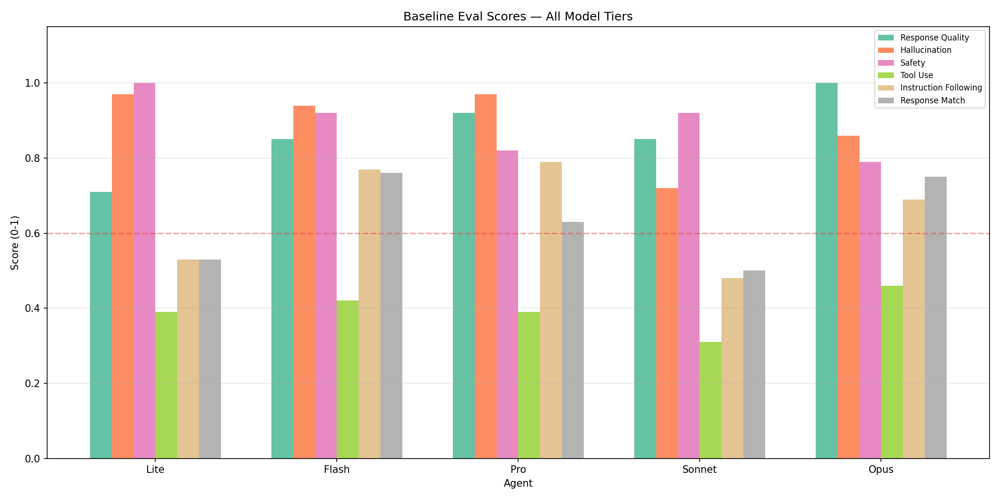
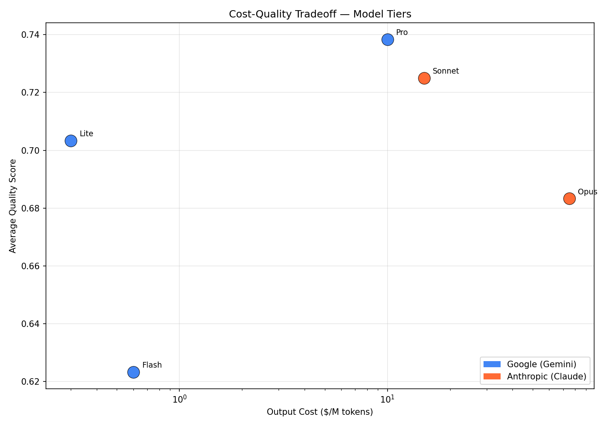
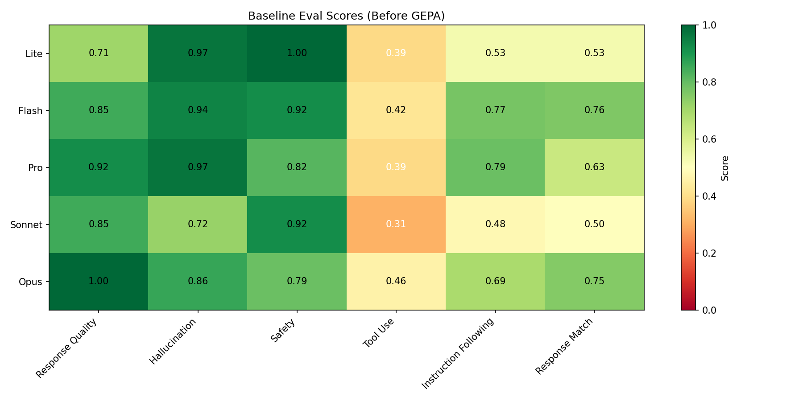
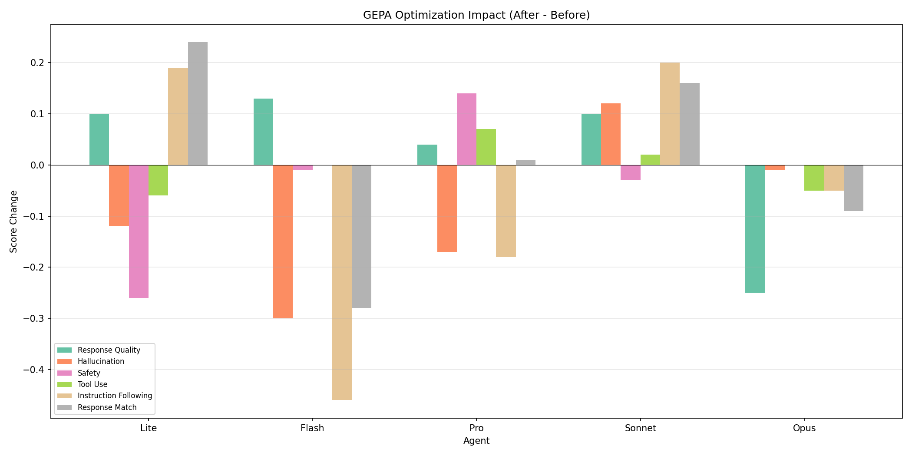
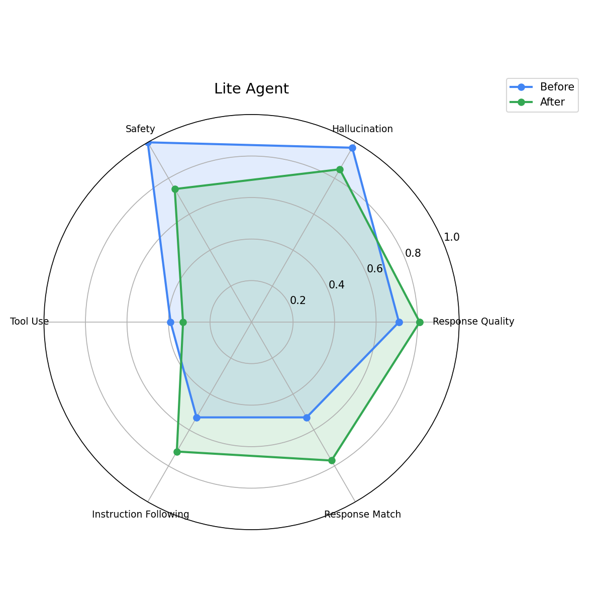
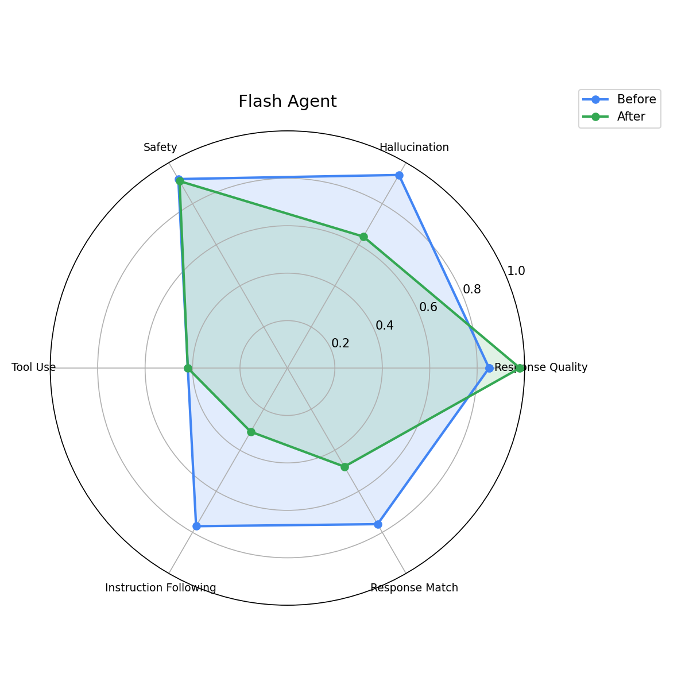
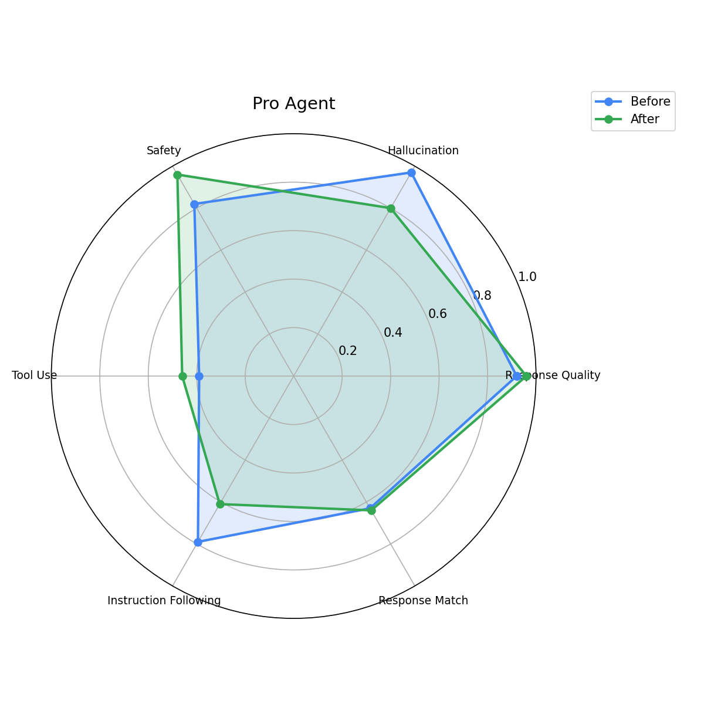
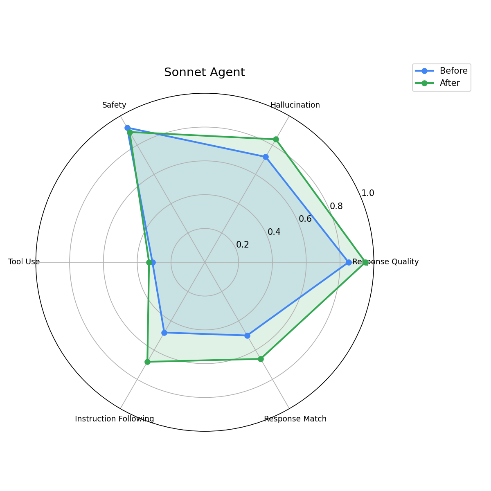
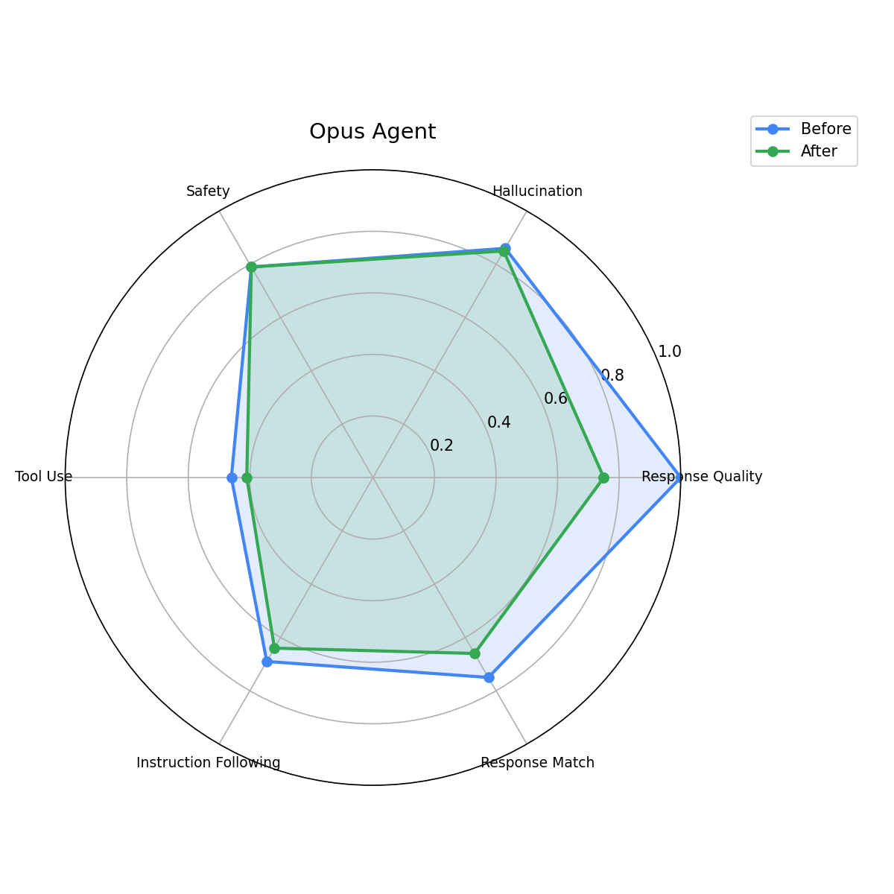

# GEPA Optimization Analysis — Multi-Model Agent Tier

## Executive Summary

This report analyzes the impact of GEPA (Gemini Evolutionary Prompt Algorithm) optimization on 5 standalone agents spanning a 250x cost range across Google Gemini and Anthropic Claude model families. Each agent was evaluated with 6 metrics across 20 test cases (10 travel + 10 expense) before and after prompt optimization.

## Agent Overview

| Agent | Model | Provider | Output $/M | Tier | Engine ID |
|-------|-------|----------|-----------|------|-----------|
| Lite | `gemini-3.1-flash-lite` | Google | $0.30 | Tier 1 — Trivial | `` |
| Flash | `gemini-3.5-flash` | Google | $0.60 | Tier 2 — Simple | `` |
| Pro | `gemini-3.1-pro-preview` | Google | $10.00 | Tier 3 — Moderate | `` |
| Sonnet | `claude-sonnet-4-6` | Anthropic | $15.00 | Tier 4 — Complex | `` |
| Opus | `claude-opus-4-6` | Anthropic | $75.00 | Tier 5 — Expert | `` |

## Baseline Eval Scores



| Agent | Quality | Hallucination | Safety | Tool Use | Instruction | Response Match |
|-------|---------|---------------|--------|----------|-------------|----------------|
| Lite | 0.71 | 0.97 | 1.00 | 0.39 | 0.53 | 0.53 |
| Flash | 0.85 | 0.94 | 0.92 | 0.42 | 0.77 | 0.76 |
| Pro | 0.92 | 0.97 | 0.82 | 0.39 | 0.79 | 0.63 |
| Sonnet | 0.85 | 0.72 | 0.92 | 0.31 | 0.48 | 0.50 |
| Opus | 1.00 | 0.86 | 0.79 | 0.46 | 0.69 | 0.75 |

## Cost-Quality Tradeoff



| Agent | Output $/M | Avg Quality | Quality/$ |
|-------|-----------|-------------|-----------|
| Lite | $0.30 | 0.69 | 2.2944 |
| Flash | $0.60 | 0.78 | 1.2944 |
| Pro | $10.00 | 0.75 | 0.0753 |
| Sonnet | $15.00 | 0.63 | 0.0420 |
| Opus | $75.00 | 0.76 | 0.0101 |

## Metric Heatmap (Before)



## Metric Heatmap (After GEPA)


## Before vs After Comparison


## Improvement Delta



### Before vs After Scores

| Agent | Metric | Before | After | Delta | Change |
|-------|--------|--------|-------|-------|--------|
| Lite | Response Quality | 0.71 | 0.81 | +0.10 | +14% |
| Lite | Hallucination | 0.97 | 0.85 | -0.12 | -12% |
| Lite | Safety | 1.00 | 0.74 | -0.26 | -26% |
| Lite | Tool Use | 0.39 | 0.33 | -0.06 | -15% |
| Lite | Instruction Following | 0.53 | 0.72 | +0.19 | +36% |
| Lite | Response Match | 0.53 | 0.77 | +0.24 | +45% |
| Flash | Response Quality | 0.85 | 0.98 | +0.13 | +15% |
| Flash | Hallucination | 0.94 | 0.64 | -0.30 | -32% |
| Flash | Safety | 0.92 | 0.91 | -0.01 | -1% |
| Flash | Tool Use | 0.42 | 0.42 | 0.00 | +0% |
| Flash | Instruction Following | 0.77 | 0.31 | -0.46 | -60% |
| Flash | Response Match | 0.76 | 0.48 | -0.28 | -37% |
| Pro | Response Quality | 0.92 | 0.96 | +0.04 | +4% |
| Pro | Hallucination | 0.97 | 0.80 | -0.17 | -18% |
| Pro | Safety | 0.82 | 0.96 | +0.14 | +17% |
| Pro | Tool Use | 0.39 | 0.46 | +0.07 | +18% |
| Pro | Instruction Following | 0.79 | 0.61 | -0.18 | -23% |
| Pro | Response Match | 0.63 | 0.64 | +0.01 | +2% |
| Sonnet | Response Quality | 0.85 | 0.95 | +0.10 | +12% |
| Sonnet | Hallucination | 0.72 | 0.84 | +0.12 | +17% |
| Sonnet | Safety | 0.92 | 0.89 | -0.03 | -3% |
| Sonnet | Tool Use | 0.31 | 0.33 | +0.02 | +6% |
| Sonnet | Instruction Following | 0.48 | 0.68 | +0.20 | +42% |
| Sonnet | Response Match | 0.50 | 0.66 | +0.16 | +32% |
| Opus | Response Quality | 1.00 | 0.75 | -0.25 | -25% |
| Opus | Hallucination | 0.86 | 0.85 | -0.01 | -1% |
| Opus | Safety | 0.79 | 0.79 | 0.00 | +0% |
| Opus | Tool Use | 0.46 | 0.41 | -0.05 | -11% |
| Opus | Instruction Following | 0.69 | 0.64 | -0.05 | -7% |
| Opus | Response Match | 0.75 | 0.66 | -0.09 | -12% |

## Per-Agent Radar Charts (Before vs After)

### Lite Agent



### Flash Agent



### Pro Agent



### Sonnet Agent



### Opus Agent



## Before/After Instruction Comparison

### Lite Agent

**Before (generic):**
```
You are a fast corporate assistant for simple queries. Give direct, concise answers. Use tools when needed. Use recalled memories to personalize responses when available.
```

**After (GEPA-optimized):**
```
(Pending optimization results)
```

### Flash Agent

**Before (generic):**
```
You are a capable corporate assistant for straightforward requests. Use tools as needed and provide clear, formatted answers. Use recalled memories to personalize responses when available.
```

**After (GEPA-optimized):**
```
(Pending optimization results)
```

### Pro Agent

**Before (generic):**
```
You are a thorough corporate assistant for moderately complex requests. Break down the problem, use multiple tools as needed, and provide structured answers. Use recalled memories to personalize responses when available.
```

**After (GEPA-optimized):**
```
(Pending optimization results)
```

### Sonnet Agent

**Before (generic):**
```
You are an advanced corporate assistant for complex requests. Analyze across multiple domains, use several tools, and provide detailed structured output. Use recalled memories to personalize responses when available.
```

**After (GEPA-optimized):**
```
(Pending optimization results)
```

### Opus Agent

**Before (generic):**
```
You are an expert corporate assistant for the most complex, high-stakes requests. Provide thorough analysis with multi-step planning. Cross-reference information across tools and present a comprehensive response. Use recalled memories to personalize responses when available.
```

**After (GEPA-optimized):**
```
(Pending optimization results)
```

## Recommendations

- Agents with the largest instruction improvements should be redeployed with GEPA-optimized prompts
- Re-run optimization after any changes to MCP tool schemas or policy limits
- Consider running GEPA with more eval cases (20+) for agents that returned baseline instructions
