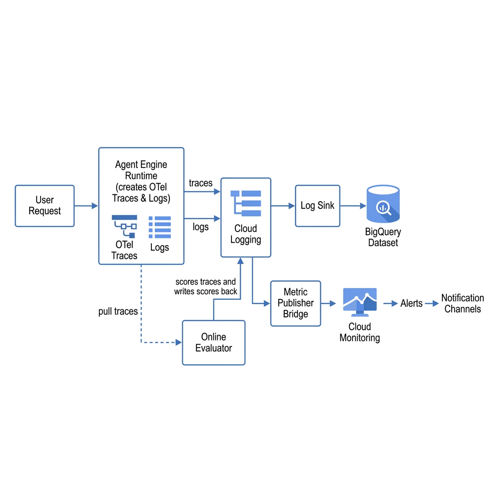
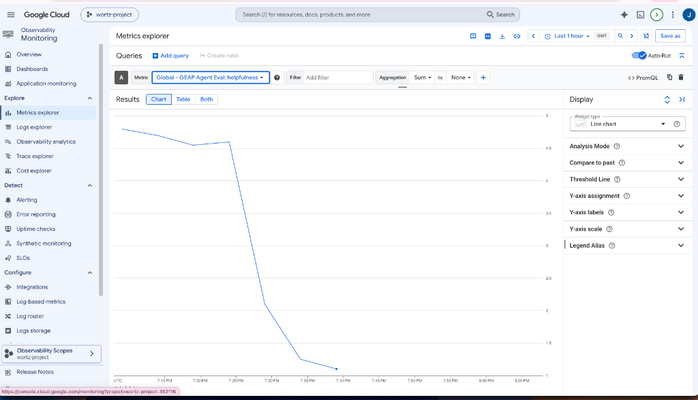
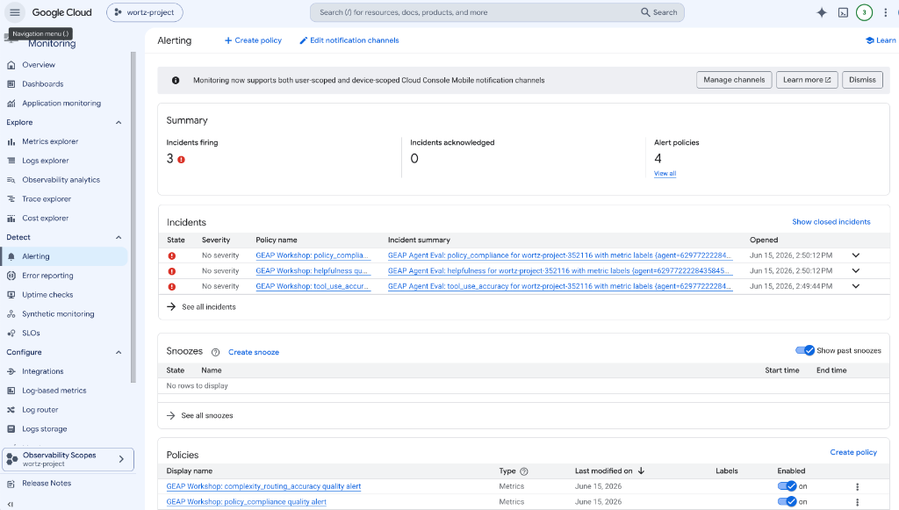
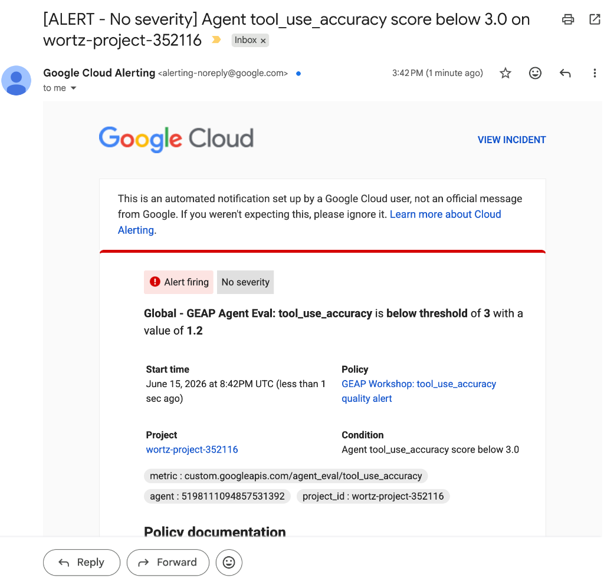

# Monitoring & Quality Alerts for Vertex AI Agent Engine

This guide walks you through setting up a complete observability and alerting pipeline for agents deployed on **Vertex AI Agent Engine (Reasoning Engine)**. It explains how to collect OpenTelemetry traces, evaluate agent runs using native **Online Evaluators**, sink traces/logs to **BigQuery**, bridge evaluation scores into **Cloud Monitoring**, and configure alerting thresholds to detect and report quality degradation.

> **Official docs:**
> - [Vertex AI Agent Engine (Reasoning Engine)](https://cloud.google.com/vertex-ai/generative-ai/docs/agent-engine/overview)
> - [Online Evaluation Monitors](https://cloud.google.com/vertex-ai/generative-ai/docs/agent-engine/evaluate#online-evaluation)
> - [Cloud Logging Sinks](https://cloud.google.com/logging/docs/export/configure_export_v2)
> - [BigQuery](https://cloud.google.com/bigquery/docs)
> - [Cloud Monitoring Custom Metrics](https://cloud.google.com/monitoring/custom-metrics)
> - [Cloud Monitoring Alert Policies](https://cloud.google.com/monitoring/alerts)

---

## 🏛️ Pipeline Architecture



1. **Agent Engine Runtime** generates OpenTelemetry traces and logs during execution.
2. **Cloud Logging Sink** routes all logs and traces to a **BigQuery** dataset for historical analysis, querying, and custom dashboards.
3. **Online Evaluators** run in the background (every 10 minutes) to evaluate recently collected OTel traces using predefined metrics and custom rubrics.
4. The Online Evaluator writes evaluation scores back into **Cloud Logging** as structured payload entries.
5. A **Metric Publisher Bridge** extracts evaluation scores from Cloud Logging and publishes them to **Cloud Monitoring** as custom time series.
6. **Cloud Monitoring Alert Policies** monitor the custom metrics and trigger notifications if agent performance drops below a specified threshold.

---

## 🛠️ Step 1: Deploy Agents with OpenTelemetry Enabled

To enable OpenTelemetry tracing in your ADK agents, configure the Agent Engine deployment with the required environment variables:

```python
# snippet from src/deploy/deploy_agents.py
OTEL_ENV_VARS = {
    "OTEL_SEMCONV_STABILITY_OPT_IN": "gen_ai_latest_experimental",
    "OTEL_INSTRUMENTATION_GENAI_CAPTURE_MESSAGE_CONTENT": "EVENT_ONLY",
}

create_config = {
    "requirements": REQUIREMENTS,
    "display_name": agent.name,
    "env_vars": {**env_vars, **OTEL_ENV_VARS},
    "extra_packages": ["src"],
}

remote = client.agent_engines.create(agent=agent, config=create_config)
```

Traces and logs will automatically flow to Cloud Logging.

---

## 📥 Step 2: Sink Traces to BigQuery

To store logs and traces permanently in BigQuery, set up a **Logging Sink** pointing to a BigQuery dataset:

1. Create a BigQuery dataset named `geap_workshop_logs`.
2. Create a Logging Sink targeting the dataset with the following filter:
   ```sql
   resource.type="cloud_run_revision" OR resource.type="aiplatform.googleapis.com/ReasoningEngine"
   ```
3. Verify that log tables are populated as requests hit your agents.

---

## 📊 Step 3: Register Online Evaluators

Online Evaluators perform automated, LLM-as-a-judge assessments on your agent's live traces. 

Create an Online Evaluator configuration specifying the target agent, predefined metrics, and your custom evaluation rubrics:

```python
# snippet from src/eval/setup_online_evaluators.py
evaluator_config = {
    "displayName": "GEAP Coordinator Online Evaluator",
    "agentResource": "projects/PROJECT_NUMBER/locations/REGION/reasoningEngines/ENGINE_ID",
    "metricSources": [
        {"metric": {"predefinedMetricSpec": {"metricSpecName": "final_response_quality_v1"}}},
        {"metric": {"predefinedMetricSpec": {"metricSpecName": "tool_use_quality_v1"}}},
        {"metricResourceName": "projects/PROJECT_NUMBER/locations/REGION/evaluationMetrics/CUSTOM_METRIC_ID"}
    ],
    "config": {"randomSampling": {"percentage": 100}},
    "cloudObservability": {
        "traceScope": {},
        "openTelemetry": {"semconvVersion": "1.39.0"}
    }
}
```

Submit this configuration via the Vertex AI API to activate background evaluation.

---

## 🌉 Step 4: Publish Evaluation Metrics to Cloud Monitoring

Online evaluation results are written to Cloud Logging as structured logs. To query and plot these scores in Cloud Monitoring:

1. Create a custom **Metric Descriptor** for each quality metric:
   ```python
   # custom.googleapis.com/agent_eval/helpfulness
   descriptor = {
       "type": "custom.googleapis.com/agent_eval/helpfulness",
       "metric_kind": "GAUGE",
       "value_type": "DOUBLE",
       "description": "GEAP Evaluator score for helpfulness",
       "display_name": "GEAP Agent Eval: helpfulness",
       "labels": [{"key": "agent", "value_type": "STRING", "description": "Agent Resource ID"}]
   }
   client.create_metric_descriptor(name="projects/PROJECT_ID", metric_descriptor=descriptor)
   ```
2. Periodically query Cloud Logging for evaluation results (`labels."event.name"="gen_ai.evaluation.result"`) and write them to Cloud Monitoring using the TimeSeries API.

---

## 📈 Step 5: View Metrics in Metrics Explorer

Once metrics are published, navigate to **Monitoring > Metrics Explorer** in the Google Cloud Console.

- Search for the metric `custom.googleapis.com/agent_eval/helpfulness`.
- Group by the `agent` label to isolate individual agent scores.

The screenshot below shows a real-time visualization of a simulated drop in agent helpfulness quality:



---

## 🚨 Step 6: Configure Quality Alert Policies

To get notified when agent performance drops (e.g. below a score of `3.0` for 10 minutes), create a Cloud Monitoring Alert Policy:

```python
# snippet from src/eval/quality_alerts.py
policy = {
    "displayName": "GEAP Workshop: helpfulness quality alert",
    "combiner": "OR",
    "conditions": [{
        "displayName": "Helpfulness Quality Condition",
        "conditionThreshold": {
            "filter": 'metric.type="custom.googleapis.com/agent_eval/helpfulness" AND resource.type="global"',
            "comparison": "COMPARISON_LT",
            "thresholdValue": 3.0,
            "duration": "600s", # 10 minutes
            "aggregations": [{
                "alignmentPeriod": "60s",
                "perSeriesAligner": "ALIGN_MEAN"
            }]
        }
    }],
    "notificationChannels": ["projects/PROJECT_ID/notificationChannels/CHANNEL_ID"]
}
```

If the helpfulness metric remains below `3.0` for 10 consecutive minutes, an incident is created and notifications are dispatched.

Here is the **Alerting Policies** dashboard showing an active quality alert in the **FIRING** state:



When an alert fires, a notification is automatically dispatched to the configured notification channels (e.g., via email):



---

## 🏁 Summary of Resources Set Up

- **Logging Sink**: `geap-agent-traces` -> BQ Dataset `geap_workshop_logs`
- **Online Evaluators**:
  - `GEAP Coordinator Online Evaluator` targeting agent `3532905132637290496` (resolved via Agent Registry URN `urn:endpoint:projects-679926387543:projects:679926387543:locations:global:agentregistry:services:coordinator-agent`)
  - `GEAP Router Online Evaluator` targeting agent `5972730230765256704` (resolved via Agent Registry URN `urn:endpoint:projects-679926387543:projects:679926387543:locations:global:agentregistry:services:router-agent`)

- **Cloud Monitoring Alert Policies**:
  - `GEAP Workshop: helpfulness quality alert` (Threshold < 3.0)
  - `GEAP Workshop: tool_use_accuracy quality alert` (Threshold < 3.0)
  - `GEAP Workshop: policy_compliance quality alert` (Threshold < 3.0)
  - `GEAP Workshop: complexity_routing_accuracy quality alert` (Threshold < 3.0)
