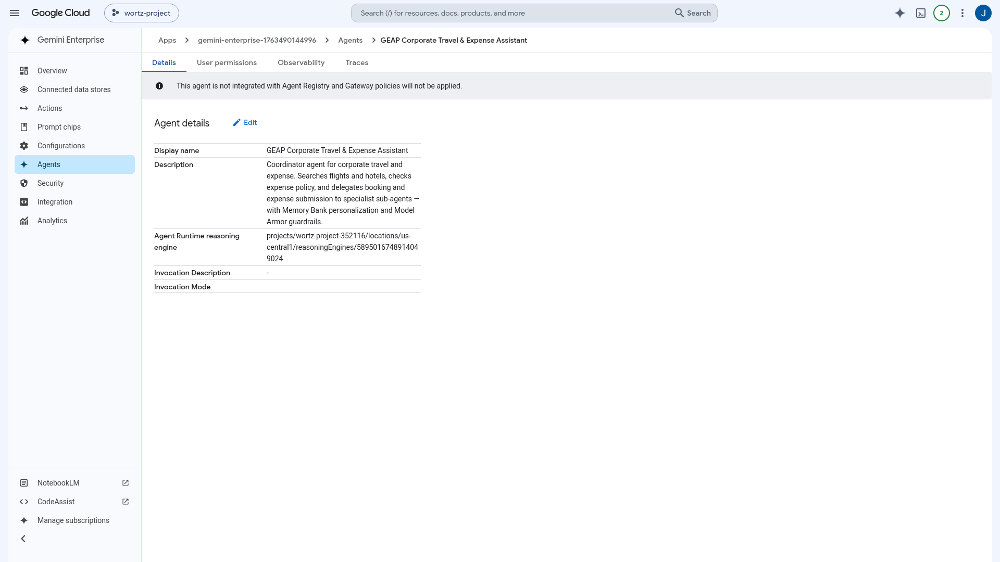
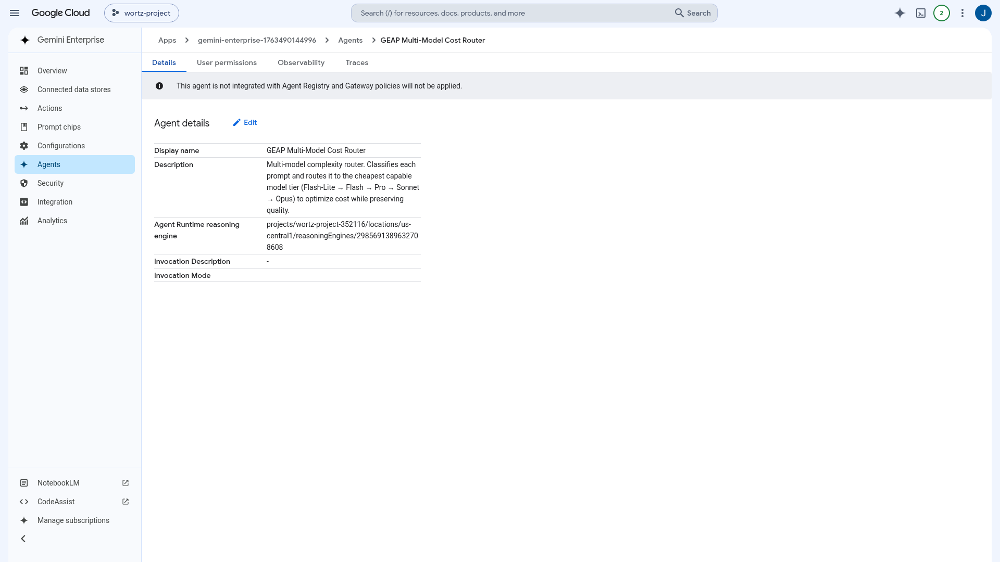

# Publish the Two ADK Agents Directly to Gemini Enterprise

This guide shows how to publish the workshop's two first-class ADK agents — **`coordinator_agent`**
(corporate travel & expense) and **`router_agent`** (multi-model cost router) — **directly** to a
Gemini Enterprise (GE) app. "Directly" means registering each agent's **Agent Runtime reasoning engine**
to the GE app via the Discovery Engine `adkAgentDefinition` → `provisionedReasoningEngine`. No Cloud Run
wrapper is involved — GE invokes the reasoning engine natively through the Agent Engine query API.

> **Official docs:**
> - [Gemini Enterprise — register an agent](https://cloud.google.com/gemini-enterprise/docs/agents)
> - [Agent Engine (Agent Runtime) overview](https://cloud.google.com/vertex-ai/generative-ai/docs/agent-engine/overview)
> - [Agent Development Kit (ADK) overview](https://cloud.google.com/vertex-ai/generative-ai/docs/agent-development-kit/overview)
> - [Discovery Engine `assistants.agents` REST reference](https://cloud.google.com/generative-ai-app-builder/docs/reference/rest/v1alpha/projects.locations.collections.engines.assistants.agents)
> - [Agent Registry overview](https://cloud.google.com/vertex-ai/generative-ai/docs/agent-registry/overview)

---

## What "publish directly" means

There are two distinct ways to surface an agent in Gemini Enterprise:

| Path | Backing | When to use | In this repo |
|------|---------|-------------|--------------|
| **ADK registration** *(this guide)* | A Vertex AI **reasoning engine** on Agent Runtime, referenced by resource name (`adkAgentDefinition.provisionedReasoningEngine`). GE invokes it natively. | Standard ADK agents already deployed to Agent Runtime. Simplest, no extra hosting. | `coordinator_agent`, `router_agent` |
| **A2A registration** | An **A2A agent card** served over HTTP (e.g. Cloud Run), referenced by `a2aAgentDefinition.jsonAgentCard`. | Custom transports, A2UI side-canvas rendering, or agents not on Agent Runtime. | Router Cost Visualizer — see [`docs/router_cost_visualizer_published.md`](router_cost_visualizer_published.md) |

The Router Cost Visualizer uses the A2A path specifically because **GE cannot invoke an *A2A* agent that
lives on Agent Runtime** (noted in `app/fast_api_app.py`), so it was wrapped in Cloud Run. That limitation
does **not** apply to ADK registration: registering the reasoning engine *directly* is a separate,
first-class path — which is exactly what this guide (and `agents-cli publish gemini-enterprise
--registration-type adk`) does.

## The two agents

| Agent | Reasoning engine (Agent Runtime, `us-central1`) | Source |
|-------|--------------------------------------------------|--------|
| `coordinator_agent` — corporate travel & expense coordinator | `reasoningEngines/5895016748914049024` | [`src/agents/coordinator_agent.py`](../src/agents/coordinator_agent.py) |
| `router_agent` — multi-model complexity/cost router | `reasoningEngines/2985691389632708608` | [`src/router/agents.py`](../src/router/agents.py) |

> Engine IDs drift as agents are redeployed. **Always resolve the live IDs** (Step 1) rather than
> trusting a value in `config.py` or `.env`.

## Prerequisites

1. **The reasoning engines are deployed.** Deploy/update with
   `uv run python -m src.deploy.deploy_agents all` (see [`src/deploy/deploy_agents.py`](../src/deploy/deploy_agents.py)).
2. **A Gemini Enterprise app exists.** This repo targets engine
   `gemini-enterprise-17634901_1763490144996` (project `wortz-project-352116`, location `global`).
   Create one in *Cloud Console → Gemini Enterprise → Apps* if you need your own.
3. **IAM**
   - The **publisher** (you / your service account) needs `roles/discoveryengine.editor` on the GE project.
   - The **GE service agent** `service-<PROJECT_NUMBER>@gcp-sa-discoveryengine.iam.gserviceaccount.com`
     needs to invoke the reasoning engines — grant `roles/aiplatform.user` on the project if agents
     register successfully but fail to respond in the console:
     ```bash
     PN=$(gcloud projects describe wortz-project-352116 --format='value(projectNumber)')
     gcloud projects add-iam-policy-binding wortz-project-352116 \
       --member="serviceAccount:service-${PN}@gcp-sa-discoveryengine.iam.gserviceaccount.com" \
       --role="roles/aiplatform.user"
     ```

## Step 1 — Find the live reasoning-engine IDs

This `gcloud` build has no `reasoning-engines`/`agent-engines` verb, so list via REST (matching by
`displayName`, which `deploy_agents.py` sets to the agent name):

```bash
TOKEN=$(gcloud auth print-access-token)
PROJ=wortz-project-352116 ; REG=us-central1
curl -s -H "Authorization: Bearer $TOKEN" -H "X-Goog-User-Project: $PROJ" \
  "https://${REG}-aiplatform.googleapis.com/v1beta1/projects/${PROJ}/locations/${REG}/reasoningEngines?pageSize=100"
# → coordinator_agent = 5895016748914049024 · router_agent = 2985691389632708608
```

(Both publishers in Step 2 do this lookup automatically; set `COORDINATOR_ENGINE_ID` / `ROUTER_ENGINE_ID`
to pin them instead.)

## Step 2 — Publish

Both options are **idempotent**: they look up any existing registration for the same reasoning engine and
PATCH it in place, otherwise they create one. Re-running never creates duplicates.

### Option A — `agents-cli` (official CLI)

Per agent, the canonical command is:

```bash
agents-cli publish gemini-enterprise \
  --registration-type adk \
  --agent-runtime-id projects/wortz-project-352116/locations/us-central1/reasoningEngines/5895016748914049024 \
  --gemini-enterprise-app-id projects/679926387543/locations/global/collections/default_collection/engines/gemini-enterprise-17634901_1763490144996 \
  --display-name "GEAP Corporate Travel & Expense Assistant" \
  --description "Coordinator agent for corporate travel and expense…" \
  --tool-description "Use for corporate travel booking, flight/hotel search, and expense-policy questions."
```

The repo wraps both agents (with live ID resolution) in one script:

```bash
set -a; source .env; set +a
bash scripts/publish_agents_to_ge.sh
```

> The GE app ID uses the **project number** (`679926387543`). The project-ID string also works against
> the API, but the CLI's canonical form is the number.

### Option B — repo script (programmatic REST, no CLI)

Depends only on `requests` + `google-auth` (already in the tree):

```bash
uv run python scripts/publish_agents_to_ge.py            # both agents
uv run python scripts/publish_agents_to_ge.py coordinator  # just one
uv run python scripts/publish_agents_to_ge.py --dry-run     # show payloads, no writes
```

Under the hood it POSTs/PATCHes this body to
`…/engines/{ENGINE_ID}/assistants/default_assistant/agents` (see [`scripts/publish_agents_to_ge.py`](../scripts/publish_agents_to_ge.py)):

```json
{
  "displayName": "GEAP Corporate Travel & Expense Assistant",
  "description": "…",
  "icon": {"uri": "https://fonts.gstatic.com/s/i/short-term/release/googlesymbols/smart_toy/default/24px.svg"},
  "adk_agent_definition": {
    "tool_settings": {"tool_description": "…"},
    "provisioned_reasoning_engine": {
      "reasoning_engine": "projects/wortz-project-352116/locations/us-central1/reasoningEngines/5895016748914049024"
    }
  }
}
```

## Step 3 — Verify in the GE console

Open the app dashboard and its **Agents** tab:

```
https://console.cloud.google.com/gemini-enterprise/locations/global/engines/gemini-enterprise-17634901_1763490144996/overview/dashboard?project=wortz-project-352116
```

Both agents should appear **Enabled**. Start a chat and pick one:

- **GEAP Corporate Travel & Expense Assistant** — *"Find me a flight to Tokyo next Tuesday and check it against expense policy."*
- **GEAP Multi-Model Cost Router** — *"Summarize this quarter's revenue drivers in three bullets."*

## Idempotency & unpublish

- **Re-publish** = re-run either publisher. It matches on
  `adkAgentDefinition.provisionedReasoningEngine.reasoningEngine` and PATCHes in place.
- **Unpublish** = delete the registration (this removes it from GE only; the reasoning engine keeps running):
  ```bash
  TOKEN=$(gcloud auth print-access-token)
  AGENT=projects/679926387543/locations/global/collections/default_collection/engines/gemini-enterprise-17634901_1763490144996/assistants/default_assistant/agents/3686131016255017939
  curl -s -X DELETE -H "Authorization: Bearer $TOKEN" -H "X-Goog-User-Project: wortz-project-352116" \
    "https://discoveryengine.googleapis.com/v1alpha/${AGENT}"
  ```

## Evidence (verified live 2026-07-29)

Published to engine `gemini-enterprise-17634901_1763490144996` (project `wortz-project-352116`, `global`):

| Agent | Reasoning engine | GE agent id | State |
|-------|------------------|-------------|-------|
| GEAP Corporate Travel & Expense Assistant | `reasoningEngines/5895016748914049024` | `3686131016255017939` | ENABLED |
| GEAP Multi-Model Cost Router | `reasoningEngines/2985691389632708608` | `13895830063069432068` | ENABLED |

Screenshots captured from the live console via the VNC/Playwright flow
([`/gcp-vnc-screenshot`](../scripts/vnc_setup.sh)):

| Screenshot | What it shows |
|---|---|
|  | Both ADK agents registered and **Enabled** in the Gemini Enterprise app |
|  | The coordinator agent, backed directly by its reasoning engine |
|  | The router agent, backed directly by its reasoning engine |
