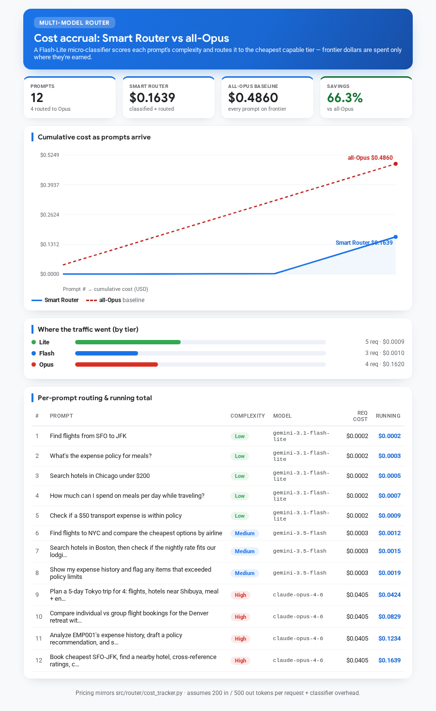
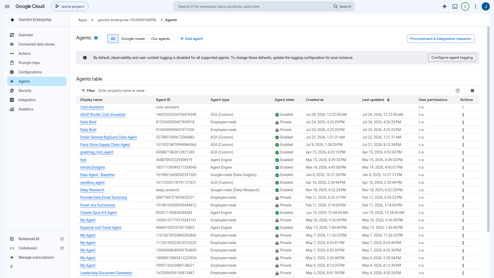
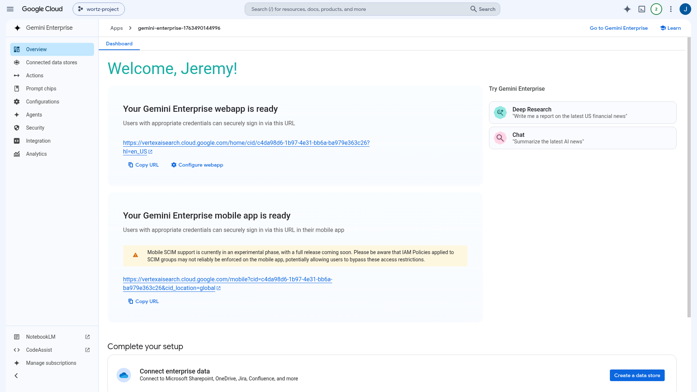

# Router Cost Visualizer — published to Gemini Enterprise

Live, verified end-to-end (2026-07-28):

- **Cloud Run (A2A/A2UI service):** https://geap-router-cost-ui-679926387543.us-east1.run.app
  - Card: `/a2a/app/.well-known/agent-card.json` (JSONRPC + A2UI v0.8 extension)
- **Gemini Enterprise engine:** `gemini-enterprise-17634901_1763490144996` (project `wortz-project-352116`, global)
  - Registered agent: **GEAP Router Cost Visualizer** · id `14432326554756478249` · A2A (Custom) · Enabled

## Evidence (captured via the VNC/Playwright screenshot flow)

| Screenshot | What it shows |
|---|---|
|  | The A2UI cost-accrual dashboard returned by the **live Cloud Run endpoint** (`message/send`): 12 prompts, 66.3% savings vs all-Opus, 4 routed to Opus |
|  | The agent registered & **Enabled** in the Gemini Enterprise Agents table |
|  | The Gemini Enterprise engine dashboard |

Redeploy/update: `bash scripts/deploy_router_ui.sh` (set `GEMINI_ENTERPRISE_AGENT_ID=14432326554756478249` in `.env` to update the registration in place).
