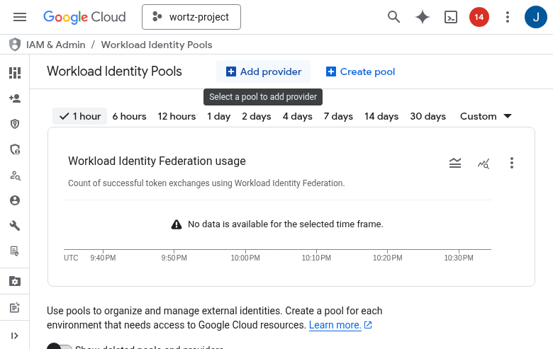
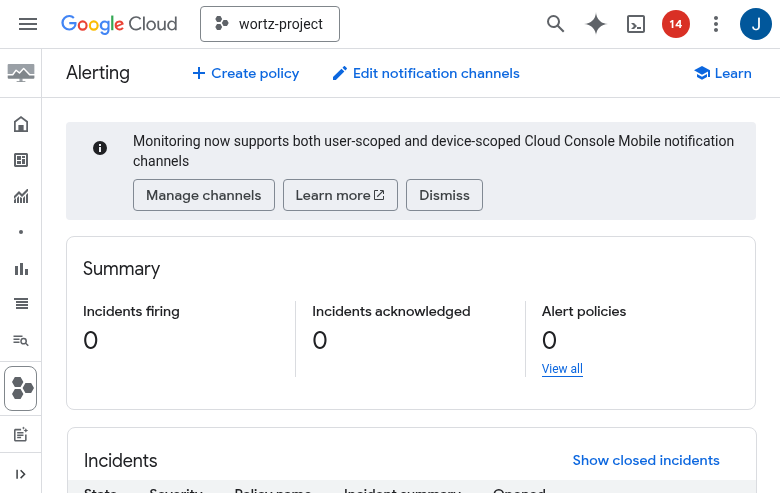
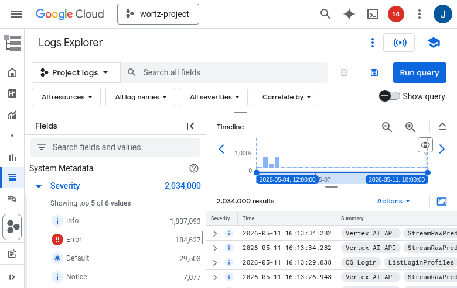
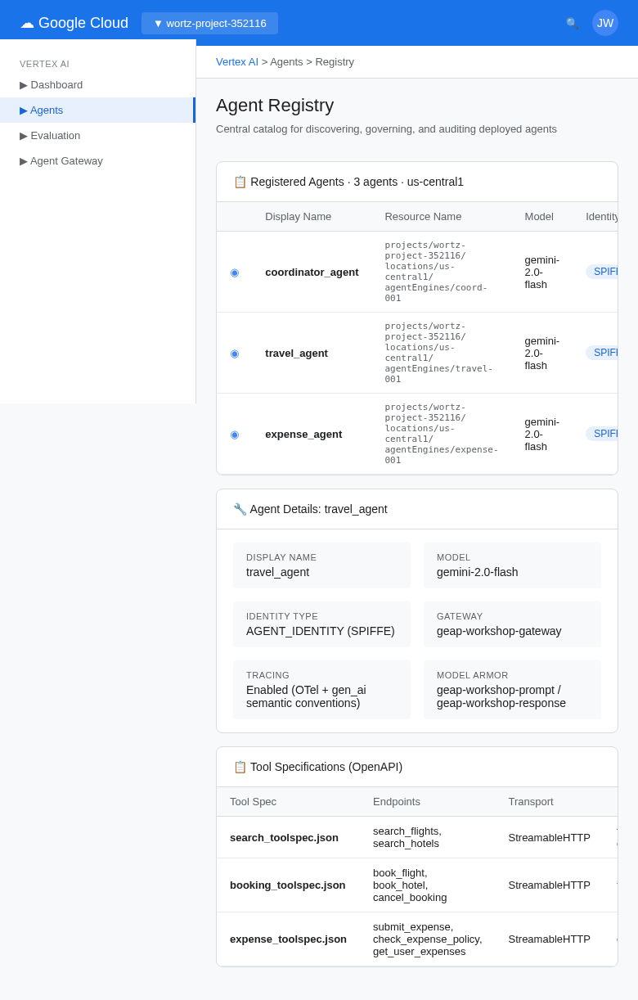

# GEAP Workshop Guide

A hands-on walkthrough of the Gemini Enterprise Agent Platform — from building agents to production governance. Organized into 4 focused sessions with breaks. Estimated time: ~3.5 hours (including lunch and break).

---

## Prerequisites

- Google Cloud project with billing enabled
- `gcloud` CLI authenticated (`gcloud auth application-default login`)
- Python 3.11+ with `uv` installed
- APIs enabled: Vertex AI, Cloud Run, Cloud Monitoring, Cloud Logging, BigQuery

```bash
gcloud services enable \
    aiplatform.googleapis.com \
    run.googleapis.com \
    monitoring.googleapis.com \
    logging.googleapis.com \
    bigquery.googleapis.com
```

---

## Agenda Overview

| Session | Topic | Duration | Key Activities |
|---------|-------|----------|----------------|
| **Session 1** | AI Gateway / MCP Gateway | ~90 min | Architecture, MCP servers, ADK agents, deployment, identity |
| | *Lunch Break* | ~45 min | |
| **Session 2** | AI Gateway / MCP Gateway (continued) | ~75 min | Agent Gateway, evaluation pipeline, observability, optimization |
| **Session 3** | Agent Registry | ~15 min | Agent registration, discovery, governance |
| **Session 4** | Model Security / Model Armor | ~15 min | Input/output screening, guardrails, content safety |
| | *Break* | ~15 min | |

---

# Session 1: AI Gateway / MCP Gateway

**Duration:** ~90 min | **Theme:** Build, connect, and deploy agents with MCP tool servers

**Learning Objectives:**
- Understand the GEAP multi-agent architecture and MCP connectivity model
- Build FastMCP tool servers and ADK agents that consume them
- Deploy MCP servers to Cloud Run and agents to Agent Runtime
- Configure agent identity with SPIFFE for secure workload authentication

**Key Diagrams:** `01_multi_agent_topology.png`, `02_deployment_architecture.png`, `04_agent_identity_gateway.png`

**Console Tours:** Vertex AI Agent Builder, Cloud Run Services, IAM Workload Identity Pools

**Screenshots:** `docs/screenshots/session1_architecture_overview.png`, `docs/screenshots/session1_cloud_run_mcp_detail.png`, `docs/screenshots/session1_agent_engine.png`, `docs/screenshots/session1_agent_builder.png`, `docs/screenshots/session1_workload_identity.png`

---

### 1.1 Architecture Overview (~10 min)

**Concept**: The GEAP provides a complete lifecycle for enterprise AI agents — build, deploy, govern, evaluate, and optimize.

**Diagram**: `diagrams/outputs/01_multi_agent_topology.png`

Our workshop system has three ADK agents sharing three MCP tool servers:
- **Coordinator Agent** — routes requests to specialists
- **Travel Agent** — searches flights/hotels, makes bookings
- **Expense Agent** — submits expenses, enforces policy limits

**Key insight**: Multiple agents can share the same MCP server (e.g., both Travel Agent and Coordinator use the Search MCP), demonstrating the 1-to-many topology.

**Screenshot**: `docs/screenshots/session1_architecture_overview.png`


---

### 1.2 MCP Server Development (~15 min)

**Code**: `src/mcp_servers/search/server.py`

MCP servers expose tools via the Model Context Protocol. We use FastMCP:

```python
from fastmcp import FastMCP

mcp = FastMCP("search-mcp")

@mcp.tool()
def search_flights(origin: str, destination: str, date: str | None = None) -> list[dict]:
    """Search available flights."""
    ...
```

Each server has:
- `mock_db.py` — in-memory data (swap with real DB in production)
- `server.py` — FastMCP tool definitions
- `Dockerfile` — for Cloud Run deployment

**Try it locally**:
```bash
# Start the search MCP server
uv run python -m src.mcp_servers.search.server
# In another terminal, test with the MCP inspector or fastmcp client
```

---

### 1.3 Building ADK Agents with MCP Tools (~15 min)

**Code**: `src/agents/travel_agent.py`

ADK agents are defined with `LlmAgent` — a model, a name, instructions, and tools:

```python
from google.adk.agents import LlmAgent
from google.adk.tools import McpToolset
from google.adk.tools.mcp_tool.mcp_toolset import StreamableHTTPConnectionParams

travel_agent = LlmAgent(
    model='gemini-2.0-flash',
    name='travel_agent',
    instruction='You help users search and book flights...',
    tools=[
        McpToolset(connection_params=StreamableHTTPConnectionParams(url=SEARCH_URL)),
        McpToolset(connection_params=StreamableHTTPConnectionParams(url=BOOKING_URL)),
    ],
)
```

**Multi-agent orchestration** (`src/agents/coordinator_agent.py`):
```python
coordinator_agent = LlmAgent(
    ...
    sub_agents=[travel_agent, expense_agent],
)
```

**Console tour**: Navigate to Vertex AI -> Agent Builder in the Cloud Console.

---

### 1.4 Multi-Agent + MCP Topology (~10 min)

**Diagram**: `diagrams/outputs/01_multi_agent_topology.png`

The topology demonstrates key GEAP patterns:
- **Agent -> MCP**: Each agent connects to MCP servers via `StreamableHTTPConnectionParams`
- **1-to-many**: The Search MCP is shared by Travel Agent and Coordinator
- **Sub-agents**: Coordinator delegates to Travel and Expense agents
- **Separation of concerns**: Tools are isolated in MCP servers, agents focus on reasoning

**Console tour**: View the agent-tool connections in the Agent Registry.

---

### 1.5 Deploying MCP Servers to Cloud Run (~15 min)

**Code**: `src/deploy/deploy_mcp_servers.py`

MCP servers deploy as standard Cloud Run services:

```bash
uv run python src/deploy/deploy_mcp_servers.py
```

This runs `gcloud run deploy` for each server with its Dockerfile.

**Console tour**: Navigate to Cloud Run -> Services. Show the three deployed MCP servers, their URLs, and logs.

**Screenshot**: `docs/screenshots/session1_cloud_run_mcp_detail.png`


**Diagram**: `diagrams/outputs/02_deployment_architecture.png`

---

### 1.6 Deploying Agents to Agent Runtime (~15 min)

**Code**: `src/deploy/deploy_agents.py`

Agents deploy to Vertex AI Agent Engine using the ADK CLI:

```bash
# Self-contained agent directory structure:
# src/agents/coordinator/
#   agent.py          — defines root_agent with sub-agents inline
#   requirements.txt  — google-cloud-aiplatform[adk,agent_engines], google-genai, fastmcp
#   .env              — MCP URLs, Model Armor templates, GCP config

adk deploy agent_engine \
    --project wortz-project-352116 \
    --region us-central1 \
    --display_name "GEAP Coordinator Agent" \
    src/agents/coordinator
```

Key deployment considerations:
- Agent code must be **self-contained** — no external `src.*` imports (cloudpickle serialization)
- All sub-agents are defined inline in `agent.py` with `root_agent` as the entry point
- MCP URLs, Model Armor templates, and config are read from environment variables
- The ADK CLI handles source bundling, dependency resolution, and pickling

**Console tour**: Navigate to Vertex AI -> Agents. Show the deployed agents, their configurations, and the "Test" panel.

**Screenshot**: `docs/screenshots/session1_agent_engine.png`


---

### 1.7 Agent Identity (SPIFFE) (~10 min)

**Script**: `scripts/setup_agent_identity.sh`

Each agent gets a SPIFFE-based identity when deployed with `identity_type=AGENT_IDENTITY`:

```
principal://agents.global.org-{ORG_ID}.system.id.goog/agent/{AGENT_ID}
```

This enables:
- **Per-agent IAM policies** — grant specific agents access to specific resources
- **Audit trails** — every action traces back to a specific agent identity
- **Workload Identity Federation** — agents authenticate without service account keys

```python
config = {"identity_type": types.IdentityType.AGENT_IDENTITY}
```

> **Note:** The `identity_type` config is set during `agent_engines.create()`. The workshop scripts configure identity via `scripts/setup_agent_identity.sh`.

**Console tour**: Navigate to IAM & Admin -> Workload Identity Pools. Show the agent pool and bound principals.

**Screenshot**: `docs/screenshots/session1_workload_identity.png`



**Diagram**: `diagrams/outputs/04_agent_identity_gateway.png`

---

> **Suggested 5-minute stretch break** before lunch if running ahead of schedule.

---

# Lunch Break

*~45-60 minutes. Morning MCP servers and agents remain deployed for the afternoon sessions.*

---

# Session 2: AI Gateway / MCP Gateway (continued)

**Duration:** ~75 min | **Theme:** Govern, evaluate, and optimize deployed agents

**Learning Objectives:**
- Configure Agent Gateway egress/ingress policies for network governance
- Run one-time, continuous, and simulated evaluations against deployed agents
- Set up CI/CD quality gates using simulated evaluation
- Analyze failure clusters and configure quality alerts
- Optimize agent instructions using the GEPA algorithm

**Prerequisite:** Session 1 agents and MCP servers must be deployed.

**Key Diagrams:** `03_eval_pipeline.png`, `04_agent_identity_gateway.png`, `05_observability_stack.png`, `06_ci_cd_flow.png`

**Console Tours:** Agent Gateway, Vertex AI Evaluation, Online Monitors, Cloud Monitoring Alerting, Cloud Trace, BigQuery, GitHub Actions

**Screenshots:** `docs/screenshots/session2_agent_gateway.png`, `docs/screenshots/session2_evaluation.png`, `docs/screenshots/session2_evaluation_pipeline.png`, `docs/screenshots/session2_monitoring_alerts.png`, `docs/screenshots/session2_cloud_trace.png`, `docs/screenshots/session2_bigquery.png`, `docs/screenshots/session2_cloud_logging.png`

---

### 2.1 Agent Gateway (~15 min)

**Script**: `scripts/setup_agent_gateway.sh`

The Agent Gateway is the central networking and security component for all agentic interactions. It operates in two modes:

| Mode | Gateway Name | Purpose |
|------|-------------|---------|
| **Client-to-Agent (ingress)** | `geap-workshop-gateway` | Controls what external clients can call your agents |
| **Agent-to-Anywhere (egress)** | `geap-workshop-gateway-egress` | Routes all outbound agent traffic (Gemini model calls, MCP tool calls, external APIs) through governance |

#### Creating Both Gateways

The ingress gateway controls inbound access:

```bash
curl -X POST \
  "https://networkservices.googleapis.com/v1alpha1/projects/${PROJECT_ID}/locations/${REGION}/agentGateways?agentGatewayId=geap-workshop-gateway" \
  -H "Authorization: Bearer $(gcloud auth print-access-token)" \
  -H "Content-Type: application/json" \
  -d '{"protocols": ["MCP"], "googleManaged": {"governedAccessPath": "CLIENT_TO_AGENT"}}'
```

The egress gateway intercepts all outbound traffic — including Gemini model calls:

```bash
curl -X POST \
  "https://networkservices.googleapis.com/v1alpha1/projects/${PROJECT_ID}/locations/${REGION}/agentGateways?agentGatewayId=geap-workshop-gateway-egress" \
  -H "Authorization: Bearer $(gcloud auth print-access-token)" \
  -H "Content-Type: application/json" \
  -d '{"protocols": ["MCP"], "googleManaged": {"governedAccessPath": "AGENT_TO_ANYWHERE"}}'
```

Or use the setup script which creates both:

```bash
bash scripts/setup_agent_gateway.sh
```

#### Connecting Agents to Both Gateways

When deploying to Agent Runtime, pass `agent_gateway_config` to route traffic through both gateways:

```python
remote = agent_engines.create(
    agent_engine=agent,
    config={
        "agent_gateway_config": {
            "client_to_agent_config": {
                "agent_gateway": f"projects/{PROJECT_ID}/locations/{REGION}/agentGateways/geap-workshop-gateway"
            },
            "agent_to_anywhere_config": {
                "agent_gateway": f"projects/{PROJECT_ID}/locations/{REGION}/agentGateways/geap-workshop-gateway-egress"
            },
        },
        "identity_type": "AGENT_IDENTITY",
    },
)
```

> **Note:** Inline gateway config requires Private Preview enrollment. The workshop deploy script (`src/deploy/deploy_agents.py`) uses a REST API fallback — see `_attach_gateway()`.

**Key insight**: With egress gateway enabled, every Gemini model call, MCP tool invocation, and external API request flows through the gateway. This means IAM Allow Policies and SGP business rules apply to model traffic — not just tool calls.

**Console tour**: Navigate to Agent Platform -> Gateways. Show both gateways, their governed access paths, and protocol configuration.

**Screenshot**: `docs/screenshots/session2_agent_gateway.png`


#### Governance Policies

**Script**: `scripts/setup_governance_policies.sh`

The Agent Gateway enforces three governance layers. The setup script handles the first two; Model Armor is configured separately.

| Layer | Type | Enforcement | Example |
|-------|------|-------------|---------|
| **Layer 1: IAM Allow Policies** | Static egress control | CEL expressions on tool attributes | "Travel agent can only use non-destructive booking tools" |
| **Layer 2: Semantic Governance (SGP)** | Runtime business rules | Natural language constraints | "Deny expenses over $200 for meals category" |
| **Layer 3: Model Armor** | Content screening | Prompt/response templates | "Block prompt injection attempts" (see Session 4) |

**Screenshot**: `docs/screenshots/session3_policies_iam.png`


##### Layer 1: IAM Allow Policies

IAM Allow policies are **static** rules that control which agents can access which MCP servers and tools. They use CEL (Common Expression Language) conditions evaluated by Identity-Aware Proxy at the gateway boundary. These always run — no extra provisioning required.

The script creates three IAM policies:

| Policy | Agent | MCP Server | Condition |
|--------|-------|------------|-----------|
| Coordinator read-only | Coordinator | Search MCP | `isReadOnly == true` |
| Travel non-destructive | Travel Agent | Booking MCP | `isDestructive == false` |
| Expense tool-level | Expense Agent | Expense MCP | `toolName in ['submit_expense', 'check_expense_policy', 'get_expenses']` |

CEL attributes available for conditions include `mcp.toolName`, `mcp.tool.isReadOnly`, `mcp.tool.isDestructive`, `mcp.tool.isIdempotent`, and `mcp.tool.isOpenWorld`.

```bash
# Run Layer 1 only (IAM policies):
bash scripts/setup_governance_policies.sh
```

##### Layer 2: Semantic Governance Policies (SGP)

SGP takes governance beyond static rules. Where IAM answers "Can this agent call this tool?", SGP answers "Should this tool call be allowed **given the current context**?" — evaluating the user prompt, chat history, and proposed tool parameters against natural language business rules at runtime.

**Key differences from IAM:**

| | IAM Allow Policies | Semantic Governance (SGP) |
|-|-------------------|--------------------------|
| **When evaluated** | Before tool dispatch | During tool dispatch, with full request context |
| **Rule language** | CEL expressions | Plain English (up to 5,000 characters) |
| **What it sees** | Tool attributes only | User prompt, chat history, tool parameters |
| **Scope** | Agent + MCP server | Agent-scope or tool-scope (specific MCP server + tool) |
| **Provisioning** | None (built-in) | Requires SGP engine (~15-20 min setup) |

**Three SGP verdicts:**

| Verdict | Behavior |
|---------|----------|
| **ALLOW** | Tool call proceeds normally |
| **DENY** | Tool call is blocked; the user sees the rationale |
| **ALLOW_IF_CONFIRMED** | Tool call is paused; the user must explicitly confirm before it executes |

**Running the script with SGP enabled:**

```bash
# Run Layer 1 (IAM) + Layer 2 (SGP):
bash scripts/setup_governance_policies.sh --sgp

# Preview commands without executing:
bash scripts/setup_governance_policies.sh --sgp --dry-run
```

When `--sgp` is passed, the script performs these additional steps:
1. Creates a VPC network and subnet for SGP engine connectivity
2. Creates a private DNS zone for internal resolution
3. Provisions the SGP engine (takes ~15-20 minutes to become ACTIVE)
4. Creates 5 example SGP policies (once the engine is ACTIVE)
5. Connects the SGP engine to both gateways via an authorization extension and policy

> **Note:** The SGP engine provisioning is a one-time step. If the engine is still provisioning (state: CREATING), re-run the script with `--sgp` after it becomes ACTIVE to create the policies and connect the gateway.

**Five example SGP policies:**

| ID | Name | Scope | Constraint | Likely Verdict |
|----|------|-------|------------|----------------|
| SGP-1 | Business Hours Enforcement | Agent-scope | No booking or expense operations outside 9 AM - 6 PM PT, Mon-Fri. Searches allowed anytime. | DENY (outside hours) |
| SGP-2 | Expense Amount Guardrail | Tool-scope (`submit_expense`) | Meals over $200 denied. Entertainment over $500 denied. Any category over $1,000 denied. | DENY |
| SGP-3 | Booking Confirmation Required | Tool-scope (`book_flight`) | Must present flight details and receive explicit user confirmation before booking. | ALLOW_IF_CONFIRMED |
| SGP-4 | Anti-Exfiltration Guard | Agent-scope | Never transmit personal data (employee IDs, emails, expense details) from one tool context to another. | DENY |
| SGP-5 | Multi-Intent Complexity Guard | Agent-scope | If a single user message bundles multiple unrelated actions (e.g., book + expense + search), require confirmation. Guards against bundled injection attacks. | ALLOW_IF_CONFIRMED |

Notice the pattern: SGP-1, SGP-4, and SGP-5 use **agent-scope** (they apply to all tool calls from the coordinator agent), while SGP-2 and SGP-3 use **tool-scope** (they target specific MCP server + tool combinations).

Navigate to Agent Platform -> Policies -> Business Policies to view active SGP rules, their scopes, and enforcement logs.

**Screenshot**: `docs/screenshots/session3_business_policies.png`


---

### 2.2 One-Time Evaluation (~15 min)

**Code**: `src/eval/one_time_eval.py`

One-time evaluation uses custom metrics with prompt templates for rubric-based scoring:

```python
HELPFULNESS_METRIC = types.Metric(
    name="helpfulness",
    prompt_template=HELPFULNESS_TEMPLATE,
)
```

Three custom metrics:
1. **Helpfulness** — relevance and actionability of responses
2. **Tool use accuracy** — correct MCP tool selection and parameters
3. **Policy compliance** — proper enforcement of expense limits

```bash
uv run python -m src.eval.one_time_eval <agent-resource-name>
```

**Console tour**: Navigate to Vertex AI -> Evaluation. Show eval results, per-metric scores, and individual sample breakdowns.

**Screenshot**: `docs/screenshots/session2_evaluation_pipeline.png`


**Diagram**: `diagrams/outputs/03_eval_pipeline.png`

---

### 2.3 Online Monitors (Continuous Eval) (~15 min)

**Code**: `src/eval/setup_online_monitors.py`

Online monitors evaluate live agent traffic on a 10-minute cycle:

1. Agent handles user requests -> OTel traces flow to Cloud Trace
2. Every 10 minutes, the monitor samples recent traces
3. Runs the same metric rubrics
4. Results flow to BigQuery for analysis

```bash
# Generate traffic first
uv run python src/traffic/generate_traffic.py

# Setup monitors
uv run python -m src.eval.setup_online_monitors <agent-resource-name>

# Wait 10+ minutes, then verify
uv run python -m src.eval.verify_monitors
```

**Manage monitors**:
```bash
uv run python -m src.eval.manage_monitors list
uv run python -m src.eval.manage_monitors pause <monitor-name>
uv run python -m src.eval.manage_monitors resume <monitor-name>
```

**Console tour**: Navigate to Vertex AI -> Evaluation -> Online Monitors. Show active monitors, their schedules, and recent results.

**Screenshot**: `docs/screenshots/session2_evaluation_pipeline.png`

---

### 2.4 Simulated Evaluation for CI/CD (~15 min)

**Code**: `src/eval/simulated_eval.py`

Simulated evaluation generates synthetic test scenarios and runs them through the agent:

```python
# 1. Generate scenarios
eval_dataset = client.evals.generate_conversation_scenarios(
    agent_info=types.evals.AgentInfo.load_from_agent(agent=agent),
    config={"count": 10, "generation_instruction": "Travel booking scenarios"},
)

# 2. Run inference
eval_with_traces = client.evals.run_inference(
    agent=agent, src=eval_dataset,
    config={"user_simulator_config": {"max_turn": 5}},
)

# 3. Evaluate
eval_result = client.evals.evaluate(
    src=eval_with_traces, config={"metrics": [helpfulness_metric]},
)
```

**CI/CD integration** (`.github/workflows/eval_ci.yaml`):
- On every PR that changes agent code -> deploy temp agent -> run simulated eval -> block if score < 3.0 -> cleanup

```bash
uv run python -m src.eval.simulated_eval <agent-resource-name> 3.0
```

**Console tour**: Show a GitHub Actions run with the eval results.

**Diagram**: `diagrams/outputs/06_ci_cd_flow.png`

---

### 2.5 Failure Clusters & Quality Alerts (~10 min)

#### Failure Clusters

**Code**: `src/eval/failure_clusters.py`

Instead of reviewing failures individually, `generate_loss_clusters()` groups similar failure patterns:

```bash
uv run python -m src.eval.failure_clusters <eval-result-name>
```

Output shows clusters with titles, descriptions, sample counts, and average scores — enabling targeted improvements.

#### Quality Alerts

**Code**: `src/eval/quality_alerts.py`

Set up Cloud Monitoring alerts that fire when eval scores drop:

```bash
# Create alert for helpfulness score dropping below 3.0
uv run python -m src.eval.quality_alerts helpfulness 3.0

# List existing alerts
uv run python -m src.eval.quality_alerts list
```

**Console tour**: Navigate to Cloud Monitoring -> Alerting. Show the alert policy, condition, and notification channel configuration.

**Screenshot**: `docs/screenshots/session2_monitoring_alerts.png`



**Observability Data Pipeline**: Agent traces flow from Cloud Logging through logging sinks into BigQuery datasets for analysis.

**Screenshot**: `docs/screenshots/session2_bigquery_sink.png`


**Screenshot**: `docs/screenshots/session2_cloud_logging.png`



**Diagram**: `diagrams/outputs/05_observability_stack.png`

---

### 2.6 Agent Optimization (GEPA) (~10 min)

**Code**: `src/optimize/run_optimize.py`

The `adk optimize` command uses the GEPA algorithm to iteratively improve agent system instructions:

1. Evaluate the current instruction against test scenarios
2. Analyze failure patterns
3. Generate instruction variants
4. Evaluate variants and select the best performer

```bash
uv run python -m src.optimize.run_optimize src.agents.travel_agent
```

This produces optimized system instructions that can be compared to the original.

**Console tour**: Show the optimization results — original vs. optimized instructions, and score improvements.

---

### 2.7 Agent Traces & Observability

The Agent Platform provides built-in trace visualization for debugging agent behavior:


Key trace metrics: session duration, model calls, tool calls, token usage, and error rates.

---

### 2.8 Multi-Model Router (~15 min)

**Code**: `src/router/agents.py`, `src/router/complexity.py`

The multi-model router dynamically selects the best model for each user prompt based on complexity. Instead of sending every request to a single model, a lightweight classifier scores the prompt and routes to the appropriate specialist:

| Complexity | Score Range | Model | Use Case |
|------------|------------|-------|----------|
| **Low** | 0.0–0.34 | `gemini-2.0-flash-lite` | Single-intent lookups, quick facts |
| **Medium** | 0.35–0.64 | `gemini-2.5-flash` | Comparisons, multi-step lookups, summaries |
| **High** | 0.65–1.0 | `claude-opus-4-7` (via LiteLLM) | Cross-domain analysis, multi-step planning |

#### Complexity Classifier

A micro-judge powered by Gemini Flash Lite scores each incoming prompt (0–1) with a one-sentence rationale:

```python
# src/router/complexity.py
async def classify_complexity(prompt: str) -> ComplexityResult:
    client = genai.Client(vertexai=True, project=GCP_PROJECT_ID, location=GCP_REGION)
    response = await client.aio.models.generate_content(
        model="gemini-2.0-flash-lite",
        contents=CLASSIFIER_PROMPT_TEMPLATE.format(prompt=prompt),
        config=GenerateContentConfig(
            response_mime_type="application/json",
            response_schema=RESPONSE_SCHEMA,
            temperature=0.0,
        ),
    )
    data = json.loads(response.text)
    score = max(0.0, min(1.0, float(data["score"])))
    return ComplexityResult(level=_score_to_level(score), score=score, reason=data.get("reason", ""))
```

#### Router Agent Architecture

The router agent uses a `before_agent_callback` to classify complexity and store it in session state, then delegates to the appropriate sub-agent:

```python
# src/router/agents.py
router_agent = LlmAgent(
    model=_resolve_model(LITE_MODEL),
    name="router_agent",
    instruction=ROUTER_INSTRUCTION,      # reads complexity_level from state
    tools=[PreloadMemoryTool()],
    sub_agents=[lite_agent, flash_agent, opus_agent],
    before_agent_callback=complexity_router_callback,
    after_agent_callback=save_memories_callback,
)
```

Each sub-agent (lite, flash, opus) has its own model, instruction style, and full MCP tool access. Non-Gemini models (like Claude) are wrapped with `LiteLlm()` for Vertex AI compatibility.

#### Deploying the Router

```bash
# Deploy the router agent alongside the coordinator
uv run python src/deploy/deploy_agents.py router

# Or deploy both coordinator and router
uv run python src/deploy/deploy_agents.py all
```

#### Testing with Complexity-Tagged Traffic

The traffic generator includes queries tagged by expected complexity:

```bash
# Generate traffic across all complexity levels
uv run python src/traffic/generate_traffic.py
```

Queries are tagged with expected complexity so you can verify routing accuracy in Cloud Trace.

---

### 2.9 Memory Bank & User Namespaces (~10 min)

**Code**: `src/agents/coordinator_agent.py`, `src/router/agents.py`

Memory Bank gives agents persistent memory across sessions. Each conversation is stored and recalled so the agent remembers user preferences, past bookings, and prior interactions.

#### How Memory Bank Works

Two components enable memory:

1. **`PreloadMemoryTool`** — injected into the agent's tools list. At the start of each turn, it retrieves relevant memories from Memory Bank and injects them into the system instruction.

2. **`save_memories_callback`** — an `after_agent_callback` that persists the session's events to Memory Bank after each turn.

```python
from google.adk.tools.preload_memory_tool import PreloadMemoryTool
from google.adk.agents.callback_context import CallbackContext

async def save_memories_callback(callback_context: CallbackContext, **kwargs):
    await callback_context.add_session_to_memory()
    return None

agent = LlmAgent(
    ...
    tools=[PreloadMemoryTool()],
    after_agent_callback=save_memories_callback,
)
```

#### User Namespaces

Memories are automatically scoped by `user_id` and `app_name`. Each user gets their own isolated memory space — Alice's booking history is never visible to Bob's sessions.

**Setting up user namespaces in traffic generation:**

```python
# Each user gets a unique session with their user_id
session = agent.create_session(user_id="alice")
response = agent.stream_query(
    user_id="alice",
    session_id=session["id"],
    message="What did I book last time?",
)
```

**Key insight**: The `user_id` parameter during `create_session()` and `stream_query()` is the namespace key. Memory Bank uses `{user_id, app_name}` as the compound key, so:
- Same `user_id` across sessions → memories persist and accumulate
- Different `user_id` values → fully isolated memory spaces
- No additional configuration needed — namespacing is automatic

**For local development**, connect to the same Memory Bank backing store:

```python
from google.adk.memory import VertexAiMemoryBankService

memory_service = VertexAiMemoryBankService(
    project=GCP_PROJECT_ID,
    location=GCP_REGION,
    agent_engine_id=AGENT_ENGINE_ID,
)
```

---

# Session 3: Agent Registry

**Duration:** ~15 min | **Theme:** Agent discovery, registration, and governance

**Learning Objectives:**
- Understand how agents are registered and discovered in the Agent Registry
- View registered agents and their tool specifications in the console
- Understand agent governance policies and metadata management

**Key Diagrams:** `02_deployment_architecture.png` (registry as part of the deployment flow)

**Console Tours:** Vertex AI -> Agents (registry view)

**Screenshots:** `docs/screenshots/session3_agent_registry.png`, `docs/screenshots/session3_agent_registry_mcp.png`

---

### 3.1 Agent Registration & Discovery (~10 min)

**Script**: `scripts/register_agent_registry.sh`

When agents are deployed to Agent Engine, they are automatically registered in the Agent Registry. MCP servers can also be registered manually to make their tools discoverable.

```bash
# Enable Agent Registry API
gcloud services enable agentregistry.googleapis.com --project="$PROJECT_ID"

# Register an MCP server with tool specification
gcloud alpha agent-registry services create search-mcp \
    --project="$PROJECT_ID" \
    --location=global \
    --display-name="Search MCP Server" \
    --mcp-server-spec-type=tool-spec \
    --mcp-server-spec-content="$(cat scripts/toolspecs/search_toolspec.json)" \
    --interfaces=url=https://search-mcp-xxx.a.run.app/mcp,protocolBinding=JSONRPC

# List registered MCP servers
gcloud alpha agent-registry mcp-servers list \
    --project="$PROJECT_ID" \
    --location=global
```

Each registered agent includes:
- **Resource name** — unique identifier for API access
- **Display name** — human-readable agent name
- **Create/update timestamps** — lifecycle tracking
- **Configuration** — model, tools, identity, gateway settings

**Console tour**: Navigate to Agent Platform -> Agent Registry -> MCP Servers. Show the registered servers, their tools, and endpoint URLs.

**Screenshots**: `docs/screenshots/session3_agent_registry.png`, `docs/screenshots/session3_agent_registry_mcp.png`




---

### 3.2 Agent Governance via Registry (~5 min)

**Code**: `scripts/toolspecs/`

The Agent Registry integrates with GEAP governance features:

- **Tool Specifications** — MCP tool specs (`scripts/toolspecs/search_toolspec.json`, `booking_toolspec.json`, `expense_toolspec.json`) document tools with `inputSchema` for each parameter, enabling discovery and compliance review
- **Identity Binding** — each registered agent's SPIFFE identity (from Session 1.7) is visible in the registry, enabling per-agent IAM policies
- **Gateway Association** — the Agent Gateway config (from Session 2.1) is attached to each agent's registry entry
- **Audit Trail** — all agent interactions are logged with the agent's identity, enabling governance teams to track which agent did what

```bash
# View a registered agent's full configuration
gcloud ai agent-engines describe <AGENT_RESOURCE_NAME> \
    --project="$PROJECT_ID" \
    --region="$REGION"
```

**Key insight**: The Agent Registry ties together identity, gateway, and observability — it's the single pane of glass for agent governance.

---

# Session 4: Model Security / Model Armor

**Duration:** ~15 min | **Theme:** Protecting agents with input/output screening and guardrails

**Learning Objectives:**
- Configure Model Armor templates for prompt/response screening (injection detection, content safety, sensitive data protection)
- Implement client-side input guardrails using `before_agent_callback`
- Test the complete armor pipeline end-to-end

**Key Diagrams:** `07_agent_armor.png`

**Console Tours:** Security -> Model Armor (templates, filter configurations, enforcement logs)

**Screenshots:** `docs/screenshots/session4_model_armor.png`

---

### 4.1 Model Armor (Content Safety) (~15 min)

**Code**: `src/armor/config.py` | **Script**: `scripts/setup_model_armor.sh`

Model Armor protects agents at two layers:

#### Layer 1: Server-side — Model Armor Templates

Model Armor templates screen every prompt and response for:
- **Prompt injection / jailbreak detection** (confidence: MEDIUM_AND_ABOVE)
- **Content safety** — hate, harassment, dangerous content, sexually explicit
- **Sensitive data protection** — SSNs, credit cards, API keys (auto-redaction)
- **Malicious URL detection** — phishing and malware links

```bash
# Create Model Armor templates in your GCP project
bash scripts/setup_model_armor.sh
```

Templates are wired into agents via `GenerateContentConfig`:

```python
from google.genai.types import GenerateContentConfig, ModelArmorConfig

travel_agent = LlmAgent(
    model='gemini-2.0-flash',
    name='travel_agent',
    instruction='...',
    tools=[...],
    generate_content_config=GenerateContentConfig(
        model_armor_config=ModelArmorConfig(
            prompt_template_name="projects/.../templates/geap-workshop-prompt",
            response_template_name="projects/.../templates/geap-workshop-response",
        )
    ),
)
```

#### Layer 2: Client-side — Input Guardrail Callback

A `before_agent_callback` runs before any request reaches the model:

```python
from src.armor.config import input_guardrail_callback

agent = LlmAgent(
    ...
    before_agent_callback=input_guardrail_callback,
)
```

The callback blocks:
- **Prompt injection patterns** — "ignore previous instructions", "system:", etc.
- **Script injection** — `<script>` tags
- **Oversized inputs** — over 4000 characters

```bash
# Test the guardrails
uv run pytest tests/test_armor.py -v
```

**Console tour**: Navigate to Security -> Model Armor in the Cloud Console. Show templates, filter configurations, and enforcement logs.

**Screenshot**: `docs/screenshots/session4_model_armor.png`


**Diagram**: `diagrams/outputs/07_agent_armor.png`

---

# Break

*~15 minutes.*

---

## Appendix: Full Deployment Sequence

### One-Liner Deploy

```bash
# Deploy everything in one command:
bash scripts/deploy_all.sh
```

This orchestrates all 9 deployment steps: API enablement, staging bucket, MCP servers (parallel), smoke tests, Model Armor, logging sink, agent gateway, agent deployment, and verification.

### Step-by-Step Deploy

```bash
# 1. Setup environment
cp .env.example .env
# Edit .env with your GCP project details
uv sync

# 2. Setup infrastructure
bash scripts/setup_agent_identity.sh
bash scripts/setup_agent_gateway.sh
bash scripts/setup_model_armor.sh
bash scripts/setup_logging_sink.sh
bash scripts/setup_governance_policies.sh          # IAM policies only
bash scripts/setup_governance_policies.sh --sgp    # Optional: add SGP engine + policies

# 3. Deploy MCP servers to Cloud Run
uv run python src/deploy/deploy_mcp_servers.py

# 4. Deploy agents to Agent Engine
adk deploy agent_engine \
    --project $GCP_PROJECT_ID \
    --region $GCP_REGION \
    --display_name "GEAP Coordinator Agent" \
    src/agents/coordinator

# 5. Generate traffic
uv run python src/traffic/generate_traffic.py

# 6. Setup evaluation
uv run python -m src.eval.setup_online_monitors <agent-resource-name>
uv run python -m src.eval.quality_alerts helpfulness 3.0

# 7. Run one-time eval
uv run python -m src.eval.one_time_eval <agent-resource-name>

# 8. Capture screenshots
uv run python scripts/capture_screenshots.py

# 9. Cleanup when done
bash scripts/cleanup.sh
```

---

## Appendix: Generating Diagrams

All architecture diagrams are generated with Paper Banana at 4K resolution:

```bash
cd diagrams
paperbanana batch --manifest batch_manifest.yaml
```

Individual diagrams:
```bash
paperbanana generate --input inputs/01_multi_agent_topology.txt --output outputs/01_multi_agent_topology.png --width 3840 --height 2160
```
